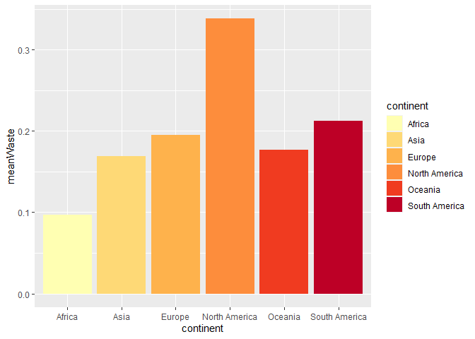
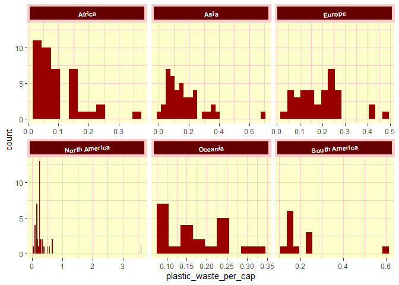
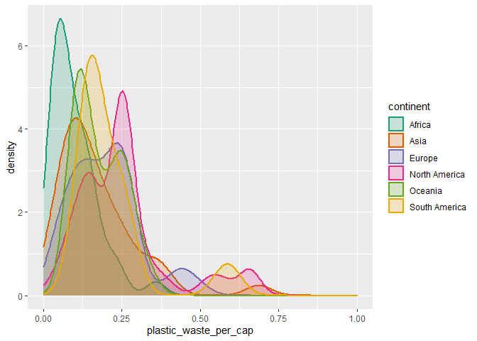
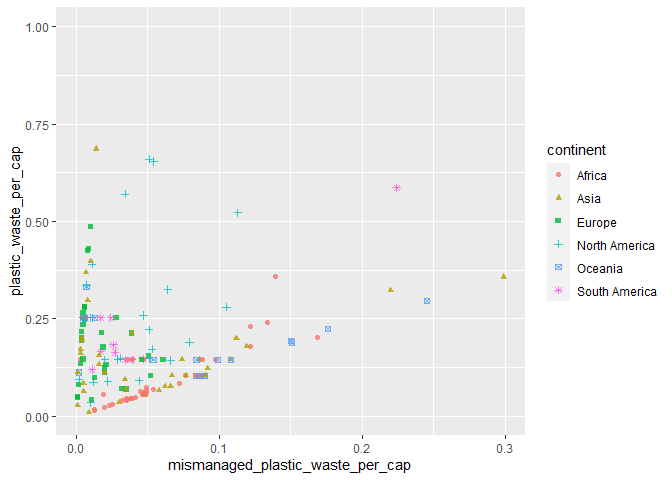
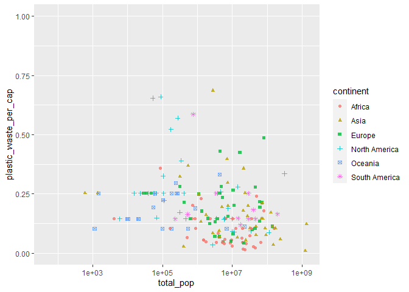
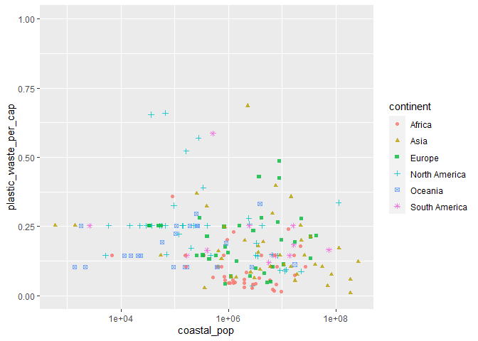
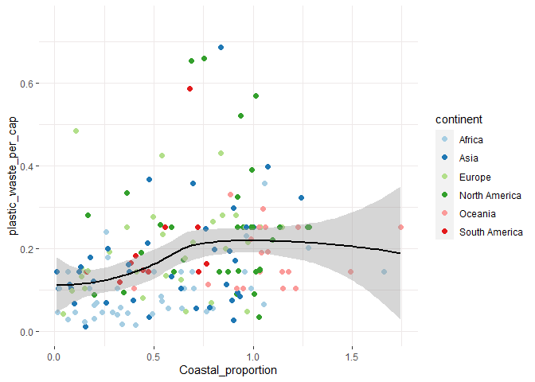

Lab 02 - Plastic waste
================
Insert your name here
Insert date here

## Load packages and data

``` r
library(tidyverse) 
```

``` r
plastic_waste <- read.csv("data/plastic-waste.csv")
```

## Some practice for fun

``` r
# Procedure 1
plastic_waste %>% group_by(continent) %>%
      summarise(meanWaste = mean(plastic_waste_per_cap, na.rm = TRUE)) %>%
      ggplot(mapping = aes( x = continent, y = meanWaste, fill = continent))+
      geom_bar(stat = "identity")+
      scale_fill_brewer(palette="YlOrRd")
```

<!-- --> ## Exercises

### Exercise 1

The histogram for plastic waste of different continents

``` r
# Procedure 2
plastic_waste %>% 
      ggplot(mapping = aes(x = plastic_waste_per_cap))+
      geom_histogram(binwidth = .03, fill = "#990000")+
      facet_wrap(~continent, nrow = 2, scales = "free_x")+
      theme(panel.background = element_rect(fill = "#FFFFCC"),
            panel.grid = element_line(color = "#FFCCCC"),
            strip.text = element_text(size=8, angle=5, face = "bold", color = "white"),
          strip.background = element_rect(colour="#FFCCCC", fill="#660000", size = 3))
```

<!-- -->

It seems that most country’s waste are lower than .3 no matter in which
continent. But there is more variation in some continents than others.

### Exercise 2.1

``` r
ggplot(data = plastic_waste, 
       mapping = aes(x = plastic_waste_per_cap, 
                     color = continent, 
                     fill = continent)) +
      scale_fill_brewer(palette="Dark2")+
      scale_color_brewer(palette="Dark2")+
      geom_density(alpha = .2, size = 1)+
      scale_x_continuous(limits = 0:1)
```

<!-- -->

``` r
# a test for producing high quality pic
# test <- ggplot(data = plastic_waste, 
#        mapping = aes(x = plastic_waste_per_cap, 
#                      color = continent, 
#                      fill = continent)) +
#       scale_fill_brewer(palette="Dark2")+
#       scale_color_brewer(palette="Dark2")+
#       geom_density(alpha = .2, size = 1)+
#       scale_x_continuous(limits = 0:1)
#ggsave( "test.png",test,  type = "cairo-png")
```

### Exercise 2.2

Because we want the color and fill vary with our variables but the alpha
here is a property for the whole graph.

### Exercise 3.1

``` r
ggplot(data = plastic_waste, 
      mapping = aes(x = continent, y = plastic_waste_per_cap)) +
      geom_violin()
```

<!-- -->

The violin graph shows more information of the distribution than the box
graph

### Exercise 4.1

``` r
plastic_waste %>% 
      ggplot(mapping = aes(x=plastic_waste_per_cap, y=mismanaged_plastic_waste_per_cap))+
      geom_point()
```

<!-- -->

### Exercise 4.2

``` r
plastic_waste %>% 
      ggplot(mapping = aes(y=plastic_waste_per_cap, x=mismanaged_plastic_waste_per_cap, shape = continent, color = continent))+
      geom_point(alpha = .8)+ 
      scale_y_continuous(limits = 0:1)
```

<!-- -->

The difference between Africa and Europe is evident from the graph. The
mismanaging rate (the slope) of African country seems much higher than
European countries.

### Exercise 4.3

``` r
plastic_waste %>% 
      ggplot(mapping = aes(y=plastic_waste_per_cap, x=total_pop, shape = continent, color = continent))+
      geom_point(alpha = .8)+ 
      scale_x_log10()+
      scale_y_continuous(limits = 0:1)
```

<!-- -->

``` r
plastic_waste %>% 
      ggplot(mapping = aes(y=plastic_waste_per_cap, x=coastal_pop, shape = continent, color = continent))+
      geom_point(alpha = .8)+ 
      scale_x_log10()+
      scale_y_continuous(limits = 0:1)
```

<!-- -->

Visually, I feel the relationship between coastal population and the
plastic waste are stronger than the relationship between total
population and the plastic waste.

### Exercise 8

Remove this text, and add your answer for Exercise 8 here.

``` r
plastic_waste$Coastal_proportion <- plastic_waste$coastal_pop / plastic_waste$total_pop

plastic_waste %>% 
      ggplot()+
      geom_point(mapping = aes(y=plastic_waste_per_cap, x=Coastal_proportion, color = continent), alpha = 1, size = 2)+ 
      scale_color_brewer(palette="Paired")+
      geom_smooth(aes(y=plastic_waste_per_cap, x=Coastal_proportion), color = "black")+
      scale_y_continuous(limits = c(0,0.75))+
      theme(panel.background = element_rect(fill = "white"),
            panel.grid = element_line(color = "snow2"))
```

<!-- -->
