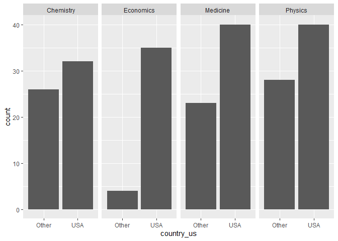
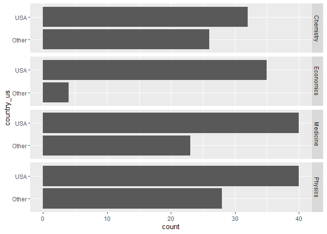
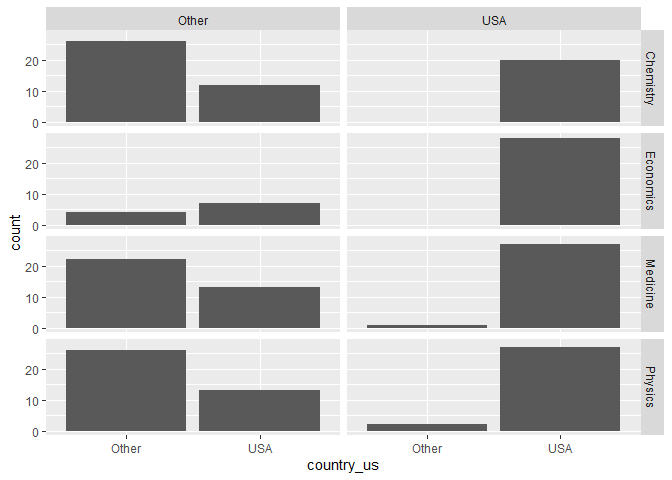

Lab 03 - Nobel laureates
================
Xuanyu
01/25/2022

### Load packages and data

``` r
library(tidyverse) 
```

``` r
nobel <- read_csv("data/nobel.csv")
```

## Exercises

### Exercise 1

915 observations and 26 variables are in the dataset

``` r
nobel |> nrow()
```

    ## [1] 935

``` r
nobel |> ncol()
```

    ## [1] 26

### Exercise 2

``` r
nobel_living <- nobel |> filter(is.na(country) == FALSE & gender != "org" & is.na(died_date))
```

### Exercise 3

``` r
nobel_living <- nobel_living %>%
  mutate(
    country_us = if_else(country == "USA", "USA", "Other")
  )

nobel_living_science <- nobel_living %>%
  filter(category %in% c("Physics", "Medicine", "Chemistry", "Economics"))

nobel_living_science |> ggplot(mapping = aes(x=country_us))+
      geom_bar()+ 
      facet_grid(cols  = vars(category))
```

<!-- -->

``` r
nobel_living_science |> ggplot(mapping = aes(x=country_us))+
      geom_bar()+ 
      facet_grid(rows   = vars(category))+
      coord_flip()
```

<!-- -->

### Exercise 4

``` r
nobel_living_science <- nobel_living_science |> mutate(
      born_country_us = if_else(born_country_original == "USA", "USA", "Other")
)
nobel_living_science |> select(born_country_us) |> summary.factor()
```

    ## Other   USA 
    ##   123   105

### Exercise 5

``` r
nobel_living_science |> ggplot(mapping = aes(x=country_us))+
      geom_bar()+ 
      facet_grid(rows   = vars(category), cols = vars(born_country_us))
```

<!-- -->

### Exercise 6

``` r
nobel_living_science |> filter(country_us == "USA" & born_country_us == "Other") |> select(born_country_original) |> group_by(born_country_original) |> summarise(count = n()) |> arrange(desc(count))
```

    ## # A tibble: 22 x 2
    ##    born_country_original                     count
    ##    <chr>                                     <int>
    ##  1 United Kingdom                                7
    ##  2 China                                         5
    ##  3 Germany                                       5
    ##  4 Canada                                        4
    ##  5 Japan                                         3
    ##  6 Australia                                     2
    ##  7 British Mandate of Palestine (now Israel)     2
    ##  8 Norway                                        2
    ##  9 West Germany (now Germany)                    2
    ## 10 Austria                                       1
    ## # ... with 12 more rows
