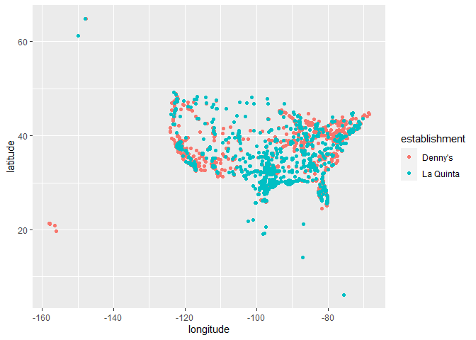
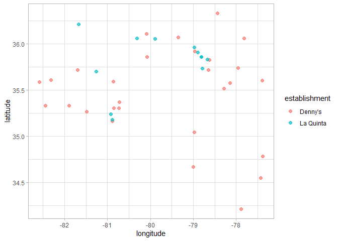
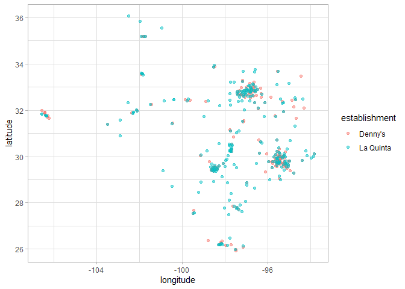

Lab 04 - La Quinta is Spanish for next to Denny’s, Pt. 1
================
Xuanyu
02/06/2022

### Load packages and data

``` r
library(tidyverse) 
library(dsbox) 
```

``` r
states <- read_csv("data/states.csv")
```

### Exercise 1

``` r
df_denny <- dennys
df_laquinta <- laquinta
nrow(df_denny)
```

    ## [1] 1643

``` r
ncol(df_denny)
```

    ## [1] 6

``` r
head(df_denny)
```

    ## # A tibble: 6 x 6
    ##   address                        city       state zip   longitude latitude
    ##   <chr>                          <chr>      <chr> <chr>     <dbl>    <dbl>
    ## 1 2900 Denali                    Anchorage  AK    99503    -150.      61.2
    ## 2 3850 Debarr Road               Anchorage  AK    99508    -150.      61.2
    ## 3 1929 Airport Way               Fairbanks  AK    99701    -148.      64.8
    ## 4 230 Connector Dr               Auburn     AL    36849     -85.5     32.6
    ## 5 224 Daniel Payne Drive N       Birmingham AL    35207     -86.8     33.6
    ## 6 900 16th St S, Commons on Gree Birmingham AL    35294     -86.8     33.5

Each row in df_denny is a branch of dennys.The variables include
address, city, state, zip code and the longitude and latitude of each
brance

### Exercise 2

``` r
nrow(df_laquinta)
```

    ## [1] 909

``` r
ncol(df_laquinta)
```

    ## [1] 6

``` r
head(df_laquinta)
```

    ## # A tibble: 6 x 6
    ##   address                    city         state zip   longitude latitude
    ##   <chr>                      <chr>        <chr> <chr>     <dbl>    <dbl>
    ## 1 793 W. Bel Air Avenue      "\nAberdeen" MD    21001     -76.2     39.5
    ## 2 3018 CatClaw Dr            "\nAbilene"  TX    79606     -99.8     32.4
    ## 3 3501 West Lake Rd          "\nAbilene"  TX    79601     -99.7     32.5
    ## 4 184 North Point Way        "\nAcworth"  GA    30102     -84.7     34.1
    ## 5 2828 East Arlington Street "\nAda"      OK    74820     -96.6     34.8
    ## 6 14925 Landmark Blvd        "\nAddison"  TX    75254     -96.8     33.0

The dimensions in laquinta dataset is about the same as the dennys.

### Exercise 3

The branches of dennys are all in the US but the branches of laquinta
are distributed across the world.

### Exercise 4

Some ways to filter the non-US branches: 1. Use the zip 2. Use the
longitude and latitude 3. Use the name of state

### Exercise 5

``` r
df_denny |> filter(!(state %in% states$abbreviation))
```

    ## # A tibble: 0 x 6
    ## # ... with 6 variables: address <chr>, city <chr>, state <chr>, zip <chr>,
    ## #   longitude <dbl>, latitude <dbl>

No branches of dennies are outside of the US

### Exercise 6

``` r
df_denny <- df_denny %>%
  mutate(country = "United States")
```

### Exercise 7

``` r
df_laquinta |> filter(!(state %in% states$abbreviation))
```

    ## # A tibble: 14 x 6
    ##    address                                  city  state zip   longitude latitude
    ##    <chr>                                    <chr> <chr> <chr>     <dbl>    <dbl>
    ##  1 Carretera Panamericana Sur KM 12         "\nA~ AG    20345    -102.     21.8 
    ##  2 Av. Tulum Mza. 14 S.M. 4 Lote 2          "\nC~ QR    77500     -86.8    21.2 
    ##  3 Ejercito Nacional 8211                   "Col~ CH    32528    -106.     31.7 
    ##  4 Blvd. Aeropuerto 4001                    "Par~ NL    66600    -100.     25.8 
    ##  5 Carrera 38 # 26-13 Avenida las Palmas c~ "\nM~ ANT   0500~     -75.6     6.22
    ##  6 AV. PINO SUAREZ No. 1001                 "Col~ NL    64000    -100.     25.7 
    ##  7 Av. Fidel Velazquez #3000 Col. Central   "\nM~ NL    64190    -100.     25.7 
    ##  8 63 King Street East                      "\nO~ ON    L1H1~     -78.9    43.9 
    ##  9 Calle Las Torres-1 Colonia Reforma       "\nP~ VE    93210     -97.4    20.6 
    ## 10 Blvd. Audi N. 3 Ciudad Modelo            "\nS~ PU    75010     -97.8    19.2 
    ## 11 Ave. Zeta del Cochero No 407             "Col~ PU    72810     -98.2    19.0 
    ## 12 Av. Benito Juarez 1230 B (Carretera 57)~ "\nS~ SL    78399    -101.     22.1 
    ## 13 Blvd. Fuerza Armadas                     "con~ FM    11101     -87.2    14.1 
    ## 14 8640 Alexandra Rd                        "\nR~ BC    V6X1~    -123.     49.2

### Exercise 8

``` r
df_laquinta <- df_laquinta %>%
  mutate(country = case_when(
    state %in% states$abbreviation     ~ "United States",
    state %in% c("ON", "BC") ~ "Canada",
    state == "ANT"           ~ "Colombia",
    TRUE ~ "other"
  ))
```

### Exercise 9

``` r
df_laquinta %>%
  count(state) %>%
      arrange(desc(n)) |>
  inner_join(states, by = c("state" = "abbreviation"))
```

    ## # A tibble: 48 x 4
    ##    state     n name          area
    ##    <chr> <int> <chr>        <dbl>
    ##  1 TX      237 Texas      268596.
    ##  2 FL       74 Florida     65758.
    ##  3 CA       56 California 163695.
    ##  4 GA       41 Georgia     59425.
    ##  5 TN       30 Tennessee   42144.
    ##  6 OK       29 Oklahoma    69899.
    ##  7 LA       28 Louisiana   52378.
    ##  8 CO       27 Colorado   104094.
    ##  9 NM       19 New Mexico 121590.
    ## 10 NY       19 New York    54555.
    ## # ... with 38 more rows

Texas has the greatest amount of the branches.

### Exercise 10

``` r
df_laquinta %>%
  count(state) %>%
            inner_join(states, by = c("state" = "abbreviation")) |>
                  mutate(perSM = n*1000/area)|>
                        arrange(desc(perSM)) 
```

    ## # A tibble: 48 x 5
    ##    state     n name             area perSM
    ##    <chr> <int> <chr>           <dbl> <dbl>
    ##  1 RI        2 Rhode Island    1545. 1.29 
    ##  2 FL       74 Florida        65758. 1.13 
    ##  3 CT        6 Connecticut     5543. 1.08 
    ##  4 MD       13 Maryland       12406. 1.05 
    ##  5 TX      237 Texas         268596. 0.882
    ##  6 TN       30 Tennessee      42144. 0.712
    ##  7 GA       41 Georgia        59425. 0.690
    ##  8 NJ        5 New Jersey      8723. 0.573
    ##  9 MA        6 Massachusetts  10554. 0.568
    ## 10 LA       28 Louisiana      52378. 0.535
    ## # ... with 38 more rows

Rowde Island and Florida have the greatest amount of laquinta per
thousand square miles.

``` r
df_denny %>%
  count(state) %>%
            inner_join(states, by = c("state" = "abbreviation")) |>
                  mutate(perSM = n*1000/area)|>
                        arrange(desc(perSM)) 
```

    ## # A tibble: 51 x 5
    ##    state     n name                     area  perSM
    ##    <chr> <int> <chr>                   <dbl>  <dbl>
    ##  1 DC        2 District of Columbia     68.3 29.3  
    ##  2 RI        5 Rhode Island           1545.   3.24 
    ##  3 CA      403 California           163695.   2.46 
    ##  4 CT       12 Connecticut            5543.   2.16 
    ##  5 FL      140 Florida               65758.   2.13 
    ##  6 MD       26 Maryland              12406.   2.10 
    ##  7 NJ       10 New Jersey             8723.   1.15 
    ##  8 NY       56 New York              54555.   1.03 
    ##  9 IN       37 Indiana               36420.   1.02 
    ## 10 OH       44 Ohio                  44826.   0.982
    ## # ... with 41 more rows

DC have the greatest amount of dennys per thousand square miles.

### Exercise 11

``` r
df_denny <- df_denny %>%
  mutate(establishment = "Denny's")
df_laquinta <- df_laquinta %>%
  mutate(establishment = "La Quinta")
df_dm <- bind_rows(df_denny,df_laquinta)
ggplot(df_dm, mapping = aes(x = longitude, y = latitude, color = establishment)) +
  geom_point()
```

<!-- --> ### Exercise
12

``` r
p1 <- df_dm |> filter(state == "NC") |>
      ggplot(mapping = aes(x = longitude, y = latitude, color = establishment))+
      geom_point(alpha = 0.7,size=2)
p1 + theme_light()
```

<!-- -->

``` r
p2 <- df_dm |> filter(state == "TX") |>
      ggplot(mapping = aes(x = longitude, y = latitude, color = establishment))+
      geom_point(alpha = 0.5,size=1.5)

p2 + theme_light()
```

<!-- -->
