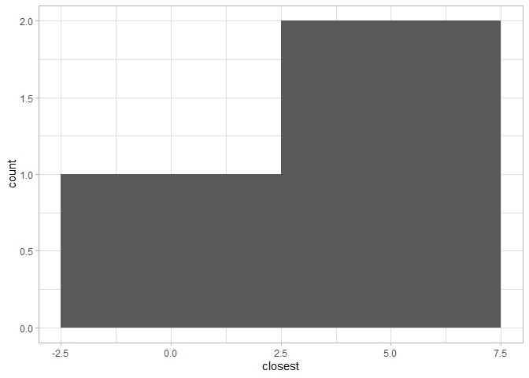
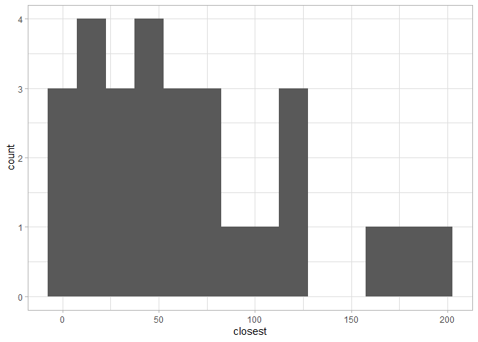
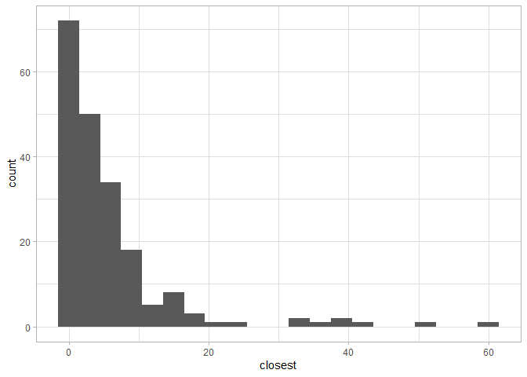
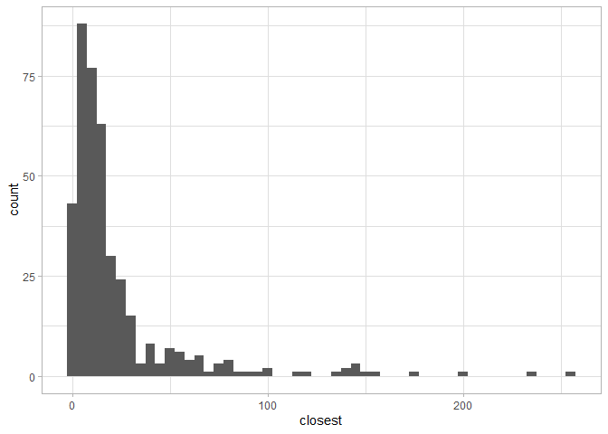

Lab 05 - La Quinta is Spanish for next to Denny’s, Pt. 2
================
Xuanyu
02/06/2022

### Load packages and data

``` r
library(tidyverse) 
library(dsbox) 
```

``` r
states <- read_csv("data/states.csv")
df_denny <- dennys
df_laquinta <- laquinta
```

### Exercise 1

``` r
df_dennyAK <- df_denny %>%
  filter(state == "AK")
nrow(df_dennyAK)
```

    ## [1] 3

### Exercise 2

``` r
df_laquintaAK <- df_laquinta %>%
  filter(state == "AK")
nrow(df_laquintaAK)
```

    ## [1] 2

### Exercise 3

we need to compute 6 different combinations of the branches.

``` r
dn_lq_ak <- full_join(df_dennyAK, df_laquintaAK, by = "state")
dn_lq_ak
```

    ## # A tibble: 6 x 11
    ##   address.x     city.x state zip.x longitude.x latitude.x address.y city.y zip.y
    ##   <chr>         <chr>  <chr> <chr>       <dbl>      <dbl> <chr>     <chr>  <chr>
    ## 1 2900 Denali   Ancho~ AK    99503       -150.       61.2 3501 Min~ "\nAn~ 99503
    ## 2 2900 Denali   Ancho~ AK    99503       -150.       61.2 4920 Dal~ "\nFa~ 99709
    ## 3 3850 Debarr ~ Ancho~ AK    99508       -150.       61.2 3501 Min~ "\nAn~ 99503
    ## 4 3850 Debarr ~ Ancho~ AK    99508       -150.       61.2 4920 Dal~ "\nFa~ 99709
    ## 5 1929 Airport~ Fairb~ AK    99701       -148.       64.8 3501 Min~ "\nAn~ 99503
    ## 6 1929 Airport~ Fairb~ AK    99701       -148.       64.8 4920 Dal~ "\nFa~ 99709
    ## # ... with 2 more variables: longitude.y <dbl>, latitude.y <dbl>

### Exercise 4

6 rows in the new dataframe. And all info excepts state are duplicated
into two columns corresponding to the two brands.

``` r
haversine <- function(long1, lat1, long2, lat2, round = 3) {
  # convert to radians
  long1 = long1 * pi / 180
  lat1  = lat1  * pi / 180
  long2 = long2 * pi / 180
  lat2  = lat2  * pi / 180
  
  R = 6371 # Earth mean radius in km
  
  a = sin((lat2 - lat1)/2)^2 + cos(lat1) * cos(lat2) * sin((long2 - long1)/2)^2
  d = R * 2 * asin(sqrt(a))
  
  return( round(d,round) ) # distance in km
}
```

### Exercise 5

we need to use mutate function

### Exercise 6

``` r
dn_lq_ak <- dn_lq_ak |> mutate(distance = haversine(longitude.x, latitude.x, longitude.y, latitude.y))
```

### Exercise 7

``` r
dn_lq_ak_mindist <- dn_lq_ak %>%
  group_by(address.x) %>%
  summarize(closest = min(distance))
```

### Exercise 8

``` r
dn_lq_ak_mindist |> summarise(mean(closest))
```

    ## # A tibble: 1 x 1
    ##   `mean(closest)`
    ##             <dbl>
    ## 1            4.41

``` r
dn_lq_ak_mindist |> ggplot(mapping = aes(x=closest))+
      geom_histogram(binwidth = 5)+theme_light()
```

<!-- -->

### Exercise 9

``` r
df_dennyNC <- df_denny %>%
  filter(state == "NC")
nrow(df_dennyNC)
```

    ## [1] 28

``` r
df_laquintaNC <- df_laquinta %>%
  filter(state == "NC")
nrow(df_laquintaNC)
```

    ## [1] 12

``` r
dn_lq_NC <- full_join(df_dennyNC, df_laquintaNC, by = "state")
dn_lq_NC <- dn_lq_NC |> mutate(distance = haversine(longitude.x, latitude.x, longitude.y, latitude.y))
dn_lq_NC_mindist <- dn_lq_NC %>%
  group_by(address.x) %>%
  summarize(closest = min(distance))

dn_lq_NC_mindist |> summarise(mean(closest))
```

    ## # A tibble: 1 x 1
    ##   `mean(closest)`
    ##             <dbl>
    ## 1            65.4

``` r
dn_lq_NC_mindist |> ggplot(mapping = aes(x=closest))+
      geom_histogram(binwidth = 15)+theme_light()
```

<!-- -->

### Exercise 10

``` r
df_dennyTX <- df_denny %>%
  filter(state == "TX")
nrow(df_dennyTX)
```

    ## [1] 200

``` r
df_laquintaTX <- df_laquinta %>%
  filter(state == "TX")
nrow(df_laquintaTX)
```

    ## [1] 237

``` r
dn_lq_TX <- full_join(df_dennyTX, df_laquintaTX, by = "state")
dn_lq_TX <- dn_lq_TX |> mutate(distaTXe = haversine(longitude.x, latitude.x, longitude.y, latitude.y))
dn_lq_TX_mindist <- dn_lq_TX %>%
  group_by(address.x) %>%
  summarize(closest = min(distaTXe))

dn_lq_TX_mindist |> summarise(mean(closest))
```

    ## # A tibble: 1 x 1
    ##   `mean(closest)`
    ##             <dbl>
    ## 1            5.79

``` r
dn_lq_TX_mindist |> ggplot(mapping = aes(x=closest))+
      geom_histogram(binwidth = 3)+theme_light()
```

<!-- -->

### Exercise 11

``` r
df_dennyCA <- df_denny %>%
  filter(state == "CA")
nrow(df_dennyCA)
```

    ## [1] 403

``` r
df_laquintaCA <- df_laquinta %>%
  filter(state == "CA")
nrow(df_laquintaCA)
```

    ## [1] 56

``` r
dn_lq_CA <- full_join(df_dennyCA, df_laquintaCA, by = "state")
dn_lq_CA <- dn_lq_CA |> mutate(distaCAe = haversine(longitude.x, latitude.x, longitude.y, latitude.y))
dn_lq_CA_mindist <- dn_lq_CA %>%
  group_by(address.x) %>%
  summarize(closest = min(distaCAe))

dn_lq_CA_mindist |> summarise(mean(closest))
```

    ## # A tibble: 1 x 1
    ##   `mean(closest)`
    ##             <dbl>
    ## 1            22.1

``` r
dn_lq_CA_mindist |> ggplot(mapping = aes(x=closest))+
      geom_histogram(binwidth = 5)+theme_light()
```

<!-- -->

### Exercise 12

The state Mitch Hedberg’s joke most likely to hold true is Alaska, where
their only 2 laquintas and 3 dennys. And the data clearly shows that
they are opened pretty near to each other. Maybe it’s due to the limited
population of Alaska and they are all gathered in the downtown of
Alaska’s capital. Also in CA and TX, which are two states have the
greatest amount of branches among all states, the distance between
laquintas and dennys are mostly very small (less than 5 kilometers). But
in a far-away state, like NC, the intergrowth pattern of two brands is
not salient.
