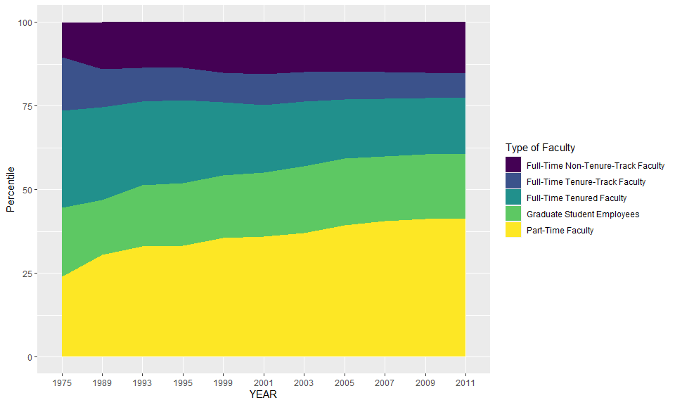
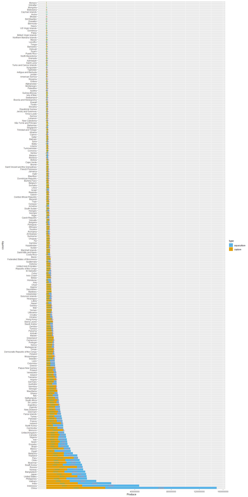

Lab 06 - Sad plots
================
Xuanyu
02/18/2022

### Load packages and data

``` r
library(tidyverse) 
library(dsbox) 
options(scipen = 999)
```

### Exercise 1 & 2

``` r
staff <- read_csv("data/instructional-staff.csv")
```

    ## Rows: 5 Columns: 12

    ## -- Column specification --------------------------------------------------------
    ## Delimiter: ","
    ## chr  (1): faculty_type
    ## dbl (11): 1975, 1989, 1993, 1995, 1999, 2001, 2003, 2005, 2007, 2009, 2011

    ## 
    ## i Use `spec()` to retrieve the full column specification for this data.
    ## i Specify the column types or set `show_col_types = FALSE` to quiet this message.

``` r
staff_long <- staff %>%
  pivot_longer(cols = -faculty_type, names_to = "year") %>%
  mutate(value = as.numeric(value))
```

``` r
staff_long %>%
  ggplot(aes(x = year, y = value, group = faculty_type, fill = faculty_type)) +
  geom_area()+
      scale_x_discrete(name = "YEAR")+
      scale_y_continuous(name = "Percentile")+
     scale_fill_viridis_d(name="Type of Faculty")
```

<!-- -->

### Exercise 3

``` r
fisheries <- read_csv("data/fisheries.csv")
```

    ## Rows: 216 Columns: 4

    ## -- Column specification --------------------------------------------------------
    ## Delimiter: ","
    ## chr (1): country
    ## dbl (3): capture, aquaculture, total

    ## 
    ## i Use `spec()` to retrieve the full column specification for this data.
    ## i Specify the column types or set `show_col_types = FALSE` to quiet this message.

``` r
fisheries_long <- fisheries %>%
      mutate(order = sqrt(capture)+sqrt(aquaculture)) %>%
  pivot_longer(cols = -c(country,total,order), names_to = "type") %>%
  mutate(value = as.numeric(value))
```

``` r
fisheries_long[-(135:136),] %>% 
      filter(value>0) %>% 
      ggplot(aes(y=reorder(country, -order),x = value, group = type, fill= type))+
      geom_col()+
      scale_x_sqrt(name = "Produce")+
      scale_y_discrete(name = "country")+
      scale_fill_manual(values= c( "#56B4E9","#E69F00"))+
      geom_text(aes(label = value, color = type), position = position_stack(vjust = 0.5), size = 2)
```

<!-- -->
