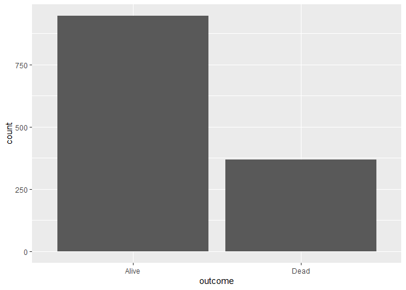

Lab 07 - Simpson’s paradox
================
Xuanyu
02/20/2022

### Load packages and data

``` r
library(tidyverse) 
library(mosaicData) 
```

### Exercise 1

``` r
myData <- Whickham
```

It’s the observational data because those data are current conditions of
people.

### Exercise 2 & 3

There are 1314 observations in this data and each row represents a
person and his information of alive or not, smoke or not and age.

``` r
myData %>% ggplot(aes(x=outcome))+
      geom_bar()
```

<!-- -->

``` r
myData %>% ggplot(aes(x=smoker))+
      geom_bar()
```

<!-- -->

``` r
myData %>% ggplot(aes(x=age))+
      geom_histogram()
```

    ## `stat_bin()` using `bins = 30`. Pick better value with `binwidth`.

<!-- -->

### Exercise 4

Smoke people will die earlier and die more.

### Exercise 5

``` r
myData %>%
  count(smoker, outcome) %>% 
      ggplot(aes(x=smoker, fill = outcome, y = n))+
      geom_histogram(stat="identity", position = "dodge2")
```

    ## Warning: Ignoring unknown parameters: binwidth, bins, pad

<!-- -->

### Exercise 6

``` r
myData <- myData %>% 
      mutate(age_cat = case_when(
            age <= 44 ~ "18-44",
            age > 44 & age <= 64 ~ "45-64",
            age > 64 ~ "65+",
      ))
```

### Exercise 7

``` r
myData %>%
  count(smoker, age_cat, outcome) %>%
      ggplot(aes(x=age_cat, fill = smoker, y = n))+
      geom_histogram(stat="identity", position = "dodge")+
      facet_wrap( ~ outcome)
```

    ## Warning: Ignoring unknown parameters: binwidth, bins, pad

<!-- -->
