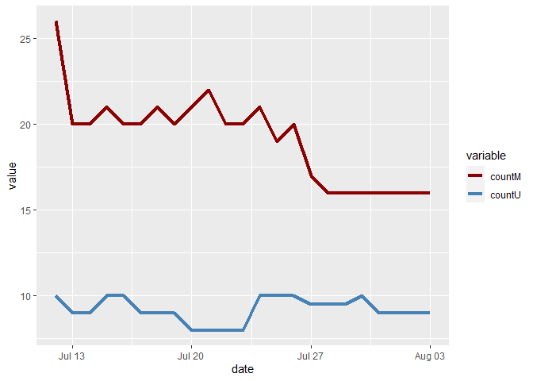

Lab 08 - Conveying the right message through visualisation
================
Xuanyu
04/07/2022

### Load packages and data

``` r
library(tidyverse) 
```

### Exercise 1

``` r
df <- tribble(
  ~date, ~countM,~countU,
  "7/12/2020", 26, 10,
  "7/13/2020",20 , 9,
  "7/14/2020",20 , 9,
  "7/15/2020",21 , 10,
  "7/16/2020", 20, 10,
  "7/17/2020", 20, 9,
  "7/18/2020", 21, 9,
  "7/19/2020", 20, 9,
  "7/20/2020", 21, 8,
  "7/21/2020", 22, 8,
  "7/22/2020", 20, 8,
  "7/23/2020", 20, 8,
  "7/24/2020", 21, 10,
  "7/25/2020", 19, 10,
  "7/26/2020", 20, 10,
  "7/27/2020", 17, 9.5,
  "7/28/2020", 16, 9.5,
  "7/29/2020", 16, 9.5,
  "7/30/2020", 16, 10,
  "7/31/2020", 16, 9,
  "8/1/2020", 16, 9,
  "8/2/2020", 16, 9,
  "8/3/2020", 16, 9
)
df$date <- as.Date(df$date, format = "%m/%d/%y")
```

### Exercise 2

…

``` r
library("reshape2")  
```

    ## 
    ## Attaching package: 'reshape2'

    ## The following object is masked from 'package:tidyr':
    ## 
    ##     smiths

``` r
df_long <- df |> melt(id = "date")
df_long |> ggplot(mapping = aes(x = date, y = value)) + 
      geom_line(aes(color = variable), size = 1.5)+
      scale_color_manual(values = c("darkred", "steelblue"))
```

<!-- -->

### Exercise 3

In the original version, they put the two lines onto two different
scales so intuitively they were about the same levels but in fact the
masked county had much higher case rate than unmasked county.

### Exercise 4

Well the data seems counter-intuitive as it makes no sense that the
masked counties should have higher rate of covid. But to think this
deeply, it may be due to the fact that the masked counties are more
politically liberal. And normally, big cities are more liberal than
small town and meanwhile big cities have greater population density
which make them more easy for the virus to spread.
