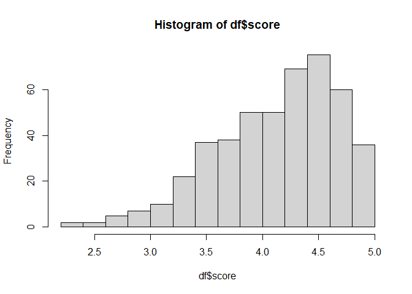
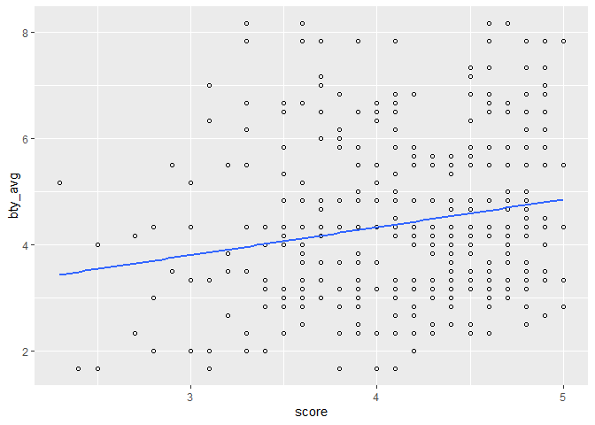
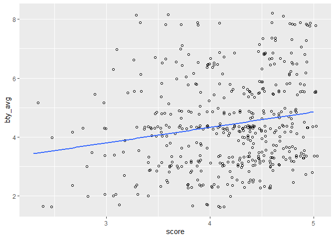
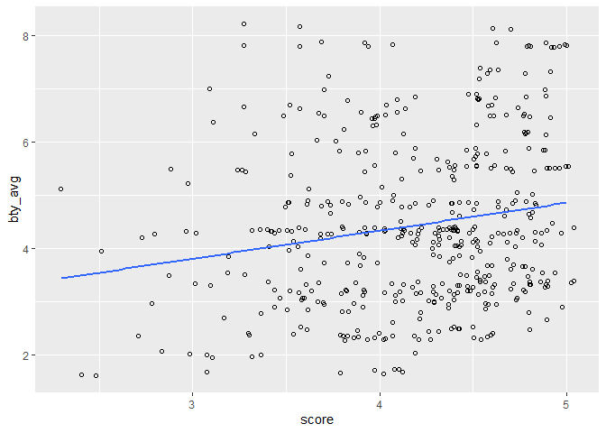

Lab 09 - Grading the professor, Pt. 1
================
Xuanyu
04/07/2022

### Load packages and data

``` r
library(tidyverse) 
library(tidymodels)
library(openintro)
```

### Exercise 1

It’s negatively skewed.

``` r
df <- evals
hist(df$score)
```

<!-- -->

### Exercise 2

``` r
ggplot(df, aes(x=score, y=bty_avg)) +
    geom_point(shape=1) +    # Use hollow circles
    geom_smooth(method=lm,   # Add linear regression line
                se=FALSE)
```

    ## `geom_smooth()` using formula 'y ~ x'

<!-- -->

### Exercise 3

``` r
ggplot(df, aes(x=score, y=bty_avg)) +
    geom_jitter(shape=1) +    # Use hollow circles
    geom_smooth(method=lm,   # Add linear regression line
                se=FALSE)
```

    ## `geom_smooth()` using formula 'y ~ x'

<!-- -->

jitter provides some random variation to the plot so the dots won’t
overlap with each other although they have the same values.

### Exercise 4

``` r
m_bty <- lm(df$score ~ df$bty_avg)
summary(m_bty)
```

    ## 
    ## Call:
    ## lm(formula = df$score ~ df$bty_avg)
    ## 
    ## Residuals:
    ##     Min      1Q  Median      3Q     Max 
    ## -1.9246 -0.3690  0.1420  0.3977  0.9309 
    ## 
    ## Coefficients:
    ##             Estimate Std. Error t value Pr(>|t|)    
    ## (Intercept)  3.88034    0.07614   50.96  < 2e-16 ***
    ## df$bty_avg   0.06664    0.01629    4.09 5.08e-05 ***
    ## ---
    ## Signif. codes:  0 '***' 0.001 '**' 0.01 '*' 0.05 '.' 0.1 ' ' 1
    ## 
    ## Residual standard error: 0.5348 on 461 degrees of freedom
    ## Multiple R-squared:  0.03502,    Adjusted R-squared:  0.03293 
    ## F-statistic: 16.73 on 1 and 461 DF,  p-value: 5.083e-05

### Exercise 5

``` r
ggplot(df, aes(x=score, y=bty_avg)) +
    geom_jitter(shape=1) +    # Use hollow circles
    geom_smooth(method=lm,   # Add linear regression line
                se=FALSE)
```

    ## `geom_smooth()` using formula 'y ~ x'

<!-- -->

### Exercise 6

Higher rating on beauty will lead to higher score.

### Exercise 7

When beauty is 0, the predicted score if 3.88.

### Exercise 8

The R2 is .04, which means 4% of the variance of the score is explained
by beauty.

### Exercise 9

``` r
m_gen <- lm(df$score ~ df$gender)
summary(m_gen)
```

    ## 
    ## Call:
    ## lm(formula = df$score ~ df$gender)
    ## 
    ## Residuals:
    ##      Min       1Q   Median       3Q      Max 
    ## -1.83433 -0.36357  0.06567  0.40718  0.90718 
    ## 
    ## Coefficients:
    ##               Estimate Std. Error t value Pr(>|t|)    
    ## (Intercept)    4.09282    0.03867 105.852  < 2e-16 ***
    ## df$gendermale  0.14151    0.05082   2.784  0.00558 ** 
    ## ---
    ## Signif. codes:  0 '***' 0.001 '**' 0.01 '*' 0.05 '.' 0.1 ' ' 1
    ## 
    ## Residual standard error: 0.5399 on 461 degrees of freedom
    ## Multiple R-squared:  0.01654,    Adjusted R-squared:  0.01441 
    ## F-statistic: 7.753 on 1 and 461 DF,  p-value: 0.005583

The mean score for female is 4.09, and the mean score for male is
significantly .14 higher than female.

### Exercise 10

For male score = 4.09 + 1 \* 0.14 For female score = 4.09 + 0 \* 1.14

### Exercise 11

``` r
m_rank <- lm(df$score ~ df$rank)
summary(m_rank)
```

    ## 
    ## Call:
    ## lm(formula = df$score ~ df$rank)
    ## 
    ## Residuals:
    ##     Min      1Q  Median      3Q     Max 
    ## -1.8546 -0.3391  0.1157  0.4305  0.8609 
    ## 
    ## Coefficients:
    ##                     Estimate Std. Error t value Pr(>|t|)    
    ## (Intercept)          4.28431    0.05365  79.853   <2e-16 ***
    ## df$ranktenure track -0.12968    0.07482  -1.733   0.0837 .  
    ## df$ranktenured      -0.14518    0.06355  -2.284   0.0228 *  
    ## ---
    ## Signif. codes:  0 '***' 0.001 '**' 0.01 '*' 0.05 '.' 0.1 ' ' 1
    ## 
    ## Residual standard error: 0.5419 on 460 degrees of freedom
    ## Multiple R-squared:  0.01163,    Adjusted R-squared:  0.007332 
    ## F-statistic: 2.706 on 2 and 460 DF,  p-value: 0.06786

``` r
df |> group_by(rank) |> summarise(mean(score))
```

    ## # A tibble: 3 x 2
    ##   rank         `mean(score)`
    ##   <fct>                <dbl>
    ## 1 teaching              4.28
    ## 2 tenure track          4.15
    ## 3 tenured               4.14

The average score of teaching professor is 4.28. And the tenure track
professor and tenured professor are -.13 and -.15 points lower than
teaching professor separately. ### Exercise 12

``` r
df$rank_relevel <- df$rank
df$rank_relevel <- relevel(df$rank_relevel, "tenure track")
m_rank_relevel <- lm(df$score ~ df$rank_relevel)
summary(m_rank_relevel)
```

    ## 
    ## Call:
    ## lm(formula = df$score ~ df$rank_relevel)
    ## 
    ## Residuals:
    ##     Min      1Q  Median      3Q     Max 
    ## -1.8546 -0.3391  0.1157  0.4305  0.8609 
    ## 
    ## Coefficients:
    ##                         Estimate Std. Error t value Pr(>|t|)    
    ## (Intercept)              4.15463    0.05214  79.680   <2e-16 ***
    ## df$rank_relevelteaching  0.12968    0.07482   1.733   0.0837 .  
    ## df$rank_releveltenured  -0.01550    0.06228  -0.249   0.8036    
    ## ---
    ## Signif. codes:  0 '***' 0.001 '**' 0.01 '*' 0.05 '.' 0.1 ' ' 1
    ## 
    ## Residual standard error: 0.5419 on 460 degrees of freedom
    ## Multiple R-squared:  0.01163,    Adjusted R-squared:  0.007332 
    ## F-statistic: 2.706 on 2 and 460 DF,  p-value: 0.06786

``` r
df |> group_by(rank_relevel) |> summarise(mean(score))
```

    ## # A tibble: 3 x 2
    ##   rank_relevel `mean(score)`
    ##   <fct>                <dbl>
    ## 1 tenure track          4.15
    ## 2 teaching              4.28
    ## 3 tenured               4.14

### Exercise 13

There’s no significant difference between tenured track professors and
teaching or tenured on scores.

### Exercise 14

``` r
df <- df |> mutate(tenure_eligible = recode_factor(rank, "teaching" = "no", "tenure track" = "yes", "tenured" = "yes"))
```

### Exercise 15

``` r
m_tenure_eligible <- lm(df$score ~ df$tenure_eligible)
summary(m_tenure_eligible)
```

    ## 
    ## Call:
    ## lm(formula = df$score ~ df$tenure_eligible)
    ## 
    ## Residuals:
    ##     Min      1Q  Median      3Q     Max 
    ## -1.8438 -0.3438  0.1157  0.4360  0.8562 
    ## 
    ## Coefficients:
    ##                       Estimate Std. Error t value Pr(>|t|)    
    ## (Intercept)             4.2843     0.0536  79.934   <2e-16 ***
    ## df$tenure_eligibleyes  -0.1406     0.0607  -2.315    0.021 *  
    ## ---
    ## Signif. codes:  0 '***' 0.001 '**' 0.01 '*' 0.05 '.' 0.1 ' ' 1
    ## 
    ## Residual standard error: 0.5413 on 461 degrees of freedom
    ## Multiple R-squared:  0.0115, Adjusted R-squared:  0.009352 
    ## F-statistic: 5.361 on 1 and 461 DF,  p-value: 0.02103
