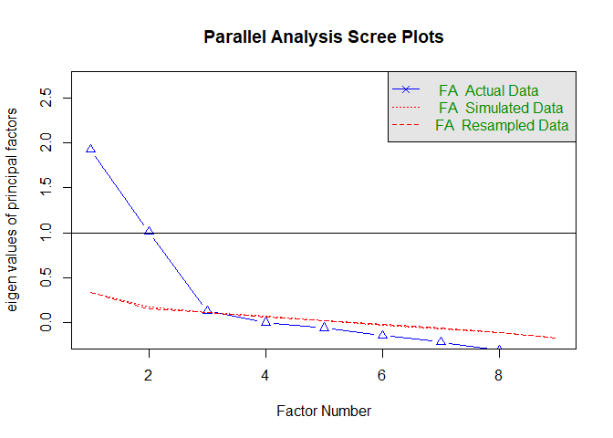
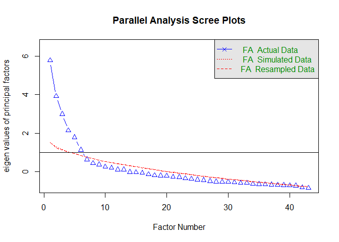

Portfolio 10
================
Xuanyu
4/26/2022

### This document is Xuanyu’s 10th (last) portfolio for Mason’s R course. This portfolio demontrates how to do EFA analysis in R and how to understand the differences between R and SPSS. Specifically, it’s my first time realizing that even using the same principle of model fitting, the mathatical formula behind them can be quite different. Here, when all using priciple axis analysis with promax rotation, the results from R package and SPSS can be slightly different from each other.

``` r
setwd(dirname(rstudioapi::getActiveDocumentContext()$path))
## #1
library(haven)
df1 <- read_sav("df1.sav")

library(psych)
library(GPArotation)


nofactors = fa.parallel(df1, fm="pa", fa="fa")
```

<!-- -->

    ## Parallel analysis suggests that the number of factors =  2  and the number of components =  NA

``` r
round1 = fa(df1, nfactors=3, rotate = "promax", fm = "pa")
round1
```

    ## Factor Analysis using method =  pa
    ## Call: fa(r = df1, nfactors = 3, rotate = "promax", fm = "pa")
    ## Standardized loadings (pattern matrix) based upon correlation matrix
    ##      PA1   PA2   PA3   h2   u2 com
    ## q1  0.17  0.43  0.11 0.21 0.79 1.5
    ## q2 -0.22  0.49  0.04 0.34 0.66 1.4
    ## q3 -0.01  0.68 -0.11 0.44 0.56 1.0
    ## q4  0.00  0.48  0.22 0.34 0.66 1.4
    ## q5  0.70  0.24 -0.38 0.72 0.28 1.8
    ## q6  0.51 -0.21  0.08 0.32 0.68 1.4
    ## q7 -0.04  0.36  0.61 0.64 0.36 1.6
    ## q8  0.74  0.18 -0.03 0.55 0.45 1.1
    ## q9  0.48 -0.06  0.02 0.24 0.76 1.0
    ## 
    ##                        PA1  PA2  PA3
    ## SS loadings           1.64 1.42 0.72
    ## Proportion Var        0.18 0.16 0.08
    ## Cumulative Var        0.18 0.34 0.42
    ## Proportion Explained  0.43 0.38 0.19
    ## Cumulative Proportion 0.43 0.81 1.00
    ## 
    ##  With factor correlations of 
    ##       PA1   PA2   PA3
    ## PA1  1.00 -0.19 -0.26
    ## PA2 -0.19  1.00  0.27
    ## PA3 -0.26  0.27  1.00
    ## 
    ## Mean item complexity =  1.4
    ## Test of the hypothesis that 3 factors are sufficient.
    ## 
    ## The degrees of freedom for the null model are  36  and the objective function was  1.8 with Chi Square of  814.28
    ## The degrees of freedom for the model are 12  and the objective function was  0.07 
    ## 
    ## The root mean square of the residuals (RMSR) is  0.03 
    ## The df corrected root mean square of the residuals is  0.05 
    ## 
    ## The harmonic number of observations is  453 with the empirical chi square  22.84  with prob <  0.029 
    ## The total number of observations was  456  with Likelihood Chi Square =  31.53  with prob <  0.0016 
    ## 
    ## Tucker Lewis Index of factoring reliability =  0.924
    ## RMSEA index =  0.06  and the 90 % confidence intervals are  0.035 0.086
    ## BIC =  -41.94
    ## Fit based upon off diagonal values = 0.99
    ## Measures of factor score adequacy             
    ##                                                    PA1  PA2  PA3
    ## Correlation of (regression) scores with factors   0.88 0.84 0.79
    ## Multiple R square of scores with factors          0.78 0.71 0.63
    ## Minimum correlation of possible factor scores     0.55 0.42 0.26

``` r
summary(round1)
```

    ## 
    ## Factor analysis with Call: fa(r = df1, nfactors = 3, rotate = "promax", fm = "pa")
    ## 
    ## Test of the hypothesis that 3 factors are sufficient.
    ## The degrees of freedom for the model is 12  and the objective function was  0.07 
    ## The number of observations was  456  with Chi Square =  31.53  with prob <  0.0016 
    ## 
    ## The root mean square of the residuals (RMSA) is  0.03 
    ## The df corrected root mean square of the residuals is  0.05 
    ## 
    ## Tucker Lewis Index of factoring reliability =  0.924
    ## RMSEA index =  0.06  and the 10 % confidence intervals are  0.035 0.086
    ## BIC =  -41.94
    ##  With factor correlations of 
    ##       PA1   PA2   PA3
    ## PA1  1.00 -0.19 -0.26
    ## PA2 -0.19  1.00  0.27
    ## PA3 -0.26  0.27  1.00

``` r
## #2
model1 <- lm(q1 ~ q2 + q3  + q4 +q5 + q6 +q7 + q8 +q9, data = df1)
summary(model1)
```

    ## 
    ## Call:
    ## lm(formula = q1 ~ q2 + q3 + q4 + q5 + q6 + q7 + q8 + q9, data = df1)
    ## 
    ## Residuals:
    ##      Min       1Q   Median       3Q      Max 
    ## -1.54980 -0.43678  0.06481  0.35916  1.39026 
    ## 
    ## Coefficients:
    ##             Estimate Std. Error t value Pr(>|t|)    
    ## (Intercept)  1.21317    0.22765   5.329 1.59e-07 ***
    ## q2           0.09247    0.04445   2.080   0.0381 *  
    ## q3           0.10310    0.04083   2.525   0.0119 *  
    ## q4           0.03826    0.04955   0.772   0.4405    
    ## q5           0.08116    0.04762   1.704   0.0891 .  
    ## q6          -0.09779    0.04139  -2.363   0.0186 *  
    ## q7           0.22611    0.04858   4.654 4.32e-06 ***
    ## q8           0.06964    0.03845   1.811   0.0708 .  
    ## q9           0.08332    0.03380   2.465   0.0141 *  
    ## ---
    ## Signif. codes:  0 '***' 0.001 '**' 0.01 '*' 0.05 '.' 0.1 ' ' 1
    ## 
    ## Residual standard error: 0.5922 on 435 degrees of freedom
    ##   (12 observations deleted due to missingness)
    ## Multiple R-squared:  0.175,  Adjusted R-squared:  0.1599 
    ## F-statistic: 11.54 on 8 and 435 DF,  p-value: 6.738e-15

``` r
model2 <- lm(q2 ~ q1 + q3  + q4 +q5 + q6 +q7 + q8 +q9, data = df1)
summary(model2)
```

    ## 
    ## Call:
    ## lm(formula = q2 ~ q1 + q3 + q4 + q5 + q6 + q7 + q8 + q9, data = df1)
    ## 
    ## Residuals:
    ##      Min       1Q   Median       3Q      Max 
    ## -1.76614 -0.42598  0.05925  0.38818  1.38073 
    ## 
    ## Coefficients:
    ##              Estimate Std. Error t value Pr(>|t|)    
    ## (Intercept)  1.741119   0.237986   7.316 1.24e-12 ***
    ## q1           0.106539   0.051210   2.080  0.03807 *  
    ## q3           0.217781   0.042897   5.077 5.70e-07 ***
    ## q4           0.083904   0.053070   1.581  0.11461    
    ## q5          -0.070408   0.051177  -1.376  0.16960    
    ## q6          -0.111515   0.044387  -2.512  0.01236 *  
    ## q7           0.167349   0.052823   3.168  0.00164 ** 
    ## q8           0.006128   0.041427   0.148  0.88248    
    ## q9          -0.069229   0.036381  -1.903  0.05772 .  
    ## ---
    ## Signif. codes:  0 '***' 0.001 '**' 0.01 '*' 0.05 '.' 0.1 ' ' 1
    ## 
    ## Residual standard error: 0.6357 on 435 degrees of freedom
    ##   (12 observations deleted due to missingness)
    ## Multiple R-squared:  0.2475, Adjusted R-squared:  0.2336 
    ## F-statistic: 17.88 on 8 and 435 DF,  p-value: < 2.2e-16

``` r
round2 = fa(df1, nfactors=2, rotate = "promax", fm = "pa")
round2
```

    ## Factor Analysis using method =  pa
    ## Call: fa(r = df1, nfactors = 2, rotate = "promax", fm = "pa")
    ## Standardized loadings (pattern matrix) based upon correlation matrix
    ##      PA1   PA2   h2   u2 com
    ## q1  0.18  0.49 0.22 0.78 1.3
    ## q2 -0.17  0.50 0.33 0.67 1.2
    ## q3  0.10  0.62 0.35 0.65 1.1
    ## q4 -0.02  0.59 0.35 0.65 1.0
    ## q5  0.81  0.09 0.62 0.38 1.0
    ## q6  0.44 -0.16 0.26 0.74 1.3
    ## q7 -0.21  0.54 0.40 0.60 1.3
    ## q8  0.78  0.20 0.56 0.44 1.1
    ## q9  0.46 -0.03 0.22 0.78 1.0
    ## 
    ##                        PA1  PA2
    ## SS loadings           1.75 1.56
    ## Proportion Var        0.19 0.17
    ## Cumulative Var        0.19 0.37
    ## Proportion Explained  0.53 0.47
    ## Cumulative Proportion 0.53 1.00
    ## 
    ##  With factor correlations of 
    ##       PA1   PA2
    ## PA1  1.00 -0.29
    ## PA2 -0.29  1.00
    ## 
    ## Mean item complexity =  1.1
    ## Test of the hypothesis that 2 factors are sufficient.
    ## 
    ## The degrees of freedom for the null model are  36  and the objective function was  1.8 with Chi Square of  814.28
    ## The degrees of freedom for the model are 19  and the objective function was  0.17 
    ## 
    ## The root mean square of the residuals (RMSR) is  0.04 
    ## The df corrected root mean square of the residuals is  0.06 
    ## 
    ## The harmonic number of observations is  453 with the empirical chi square  58.48  with prob <  6.7e-06 
    ## The total number of observations was  456  with Likelihood Chi Square =  77.89  with prob <  4.3e-09 
    ## 
    ## Tucker Lewis Index of factoring reliability =  0.856
    ## RMSEA index =  0.082  and the 90 % confidence intervals are  0.064 0.102
    ## BIC =  -38.44
    ## Fit based upon off diagonal values = 0.97
    ## Measures of factor score adequacy             
    ##                                                    PA1  PA2
    ## Correlation of (regression) scores with factors   0.89 0.84
    ## Multiple R square of scores with factors          0.79 0.71
    ## Minimum correlation of possible factor scores     0.58 0.42

``` r
round3 = fa(df1, nfactors=2, rotate = "none", fm = "pa")
round3
```

    ## Factor Analysis using method =  pa
    ## Call: fa(r = df1, nfactors = 2, rotate = "none", fm = "pa")
    ## Standardized loadings (pattern matrix) based upon correlation matrix
    ##      PA1  PA2   h2   u2 com
    ## q1  0.21 0.42 0.22 0.78 1.4
    ## q2  0.52 0.25 0.33 0.67 1.5
    ## q3  0.37 0.47 0.35 0.65 1.9
    ## q4  0.45 0.39 0.35 0.65 2.0
    ## q5 -0.63 0.47 0.62 0.38 1.8
    ## q6 -0.50 0.11 0.26 0.74 1.1
    ## q7  0.57 0.26 0.40 0.60 1.4
    ## q8 -0.53 0.53 0.56 0.44 2.0
    ## q9 -0.42 0.21 0.22 0.78 1.5
    ## 
    ##                        PA1  PA2
    ## SS loadings           2.08 1.24
    ## Proportion Var        0.23 0.14
    ## Cumulative Var        0.23 0.37
    ## Proportion Explained  0.63 0.37
    ## Cumulative Proportion 0.63 1.00
    ## 
    ## Mean item complexity =  1.6
    ## Test of the hypothesis that 2 factors are sufficient.
    ## 
    ## The degrees of freedom for the null model are  36  and the objective function was  1.8 with Chi Square of  814.28
    ## The degrees of freedom for the model are 19  and the objective function was  0.17 
    ## 
    ## The root mean square of the residuals (RMSR) is  0.04 
    ## The df corrected root mean square of the residuals is  0.06 
    ## 
    ## The harmonic number of observations is  453 with the empirical chi square  58.48  with prob <  6.7e-06 
    ## The total number of observations was  456  with Likelihood Chi Square =  77.89  with prob <  4.3e-09 
    ## 
    ## Tucker Lewis Index of factoring reliability =  0.856
    ## RMSEA index =  0.082  and the 90 % confidence intervals are  0.064 0.102
    ## BIC =  -38.44
    ## Fit based upon off diagonal values = 0.97
    ## Measures of factor score adequacy             
    ##                                                    PA1  PA2
    ## Correlation of (regression) scores with factors   0.89 0.83
    ## Multiple R square of scores with factors          0.79 0.69
    ## Minimum correlation of possible factor scores     0.57 0.38

``` r
## #3
df2 <- read_sav("df2.sav")[,-1]


#df2[,c(2,6,8,9,12,18,21,23,24,27,31,34,35,37,41,43)] <- 6 - df2[,c(2,6,8,9,12,18,21,23,24,27,31,34,35,37,41,43)]

nofactors = fa.parallel(df2, fm="pa", fa="fa")
```

<!-- -->

    ## Parallel analysis suggests that the number of factors =  6  and the number of components =  NA

``` r
mf1 <- fa(df2, nfactors = 5, rotate ="promax", fm = "pa" )
mf1
```

    ## Factor Analysis using method =  pa
    ## Call: fa(r = df2, nfactors = 5, rotate = "promax", fm = "pa")
    ## Standardized loadings (pattern matrix) based upon correlation matrix
    ##          PA2   PA1   PA4   PA3   PA5   h2   u2 com
    ## item02 -0.15  0.44 -0.03 -0.12 -0.28 0.36 0.64 2.1
    ## item03  0.06  0.07  0.71 -0.02  0.20 0.56 0.44 1.2
    ## item04  0.15 -0.30 -0.14 -0.19  0.38 0.44 0.56 3.1
    ## item05  0.62  0.02 -0.04  0.15 -0.07 0.44 0.56 1.2
    ## item06 -0.09  0.00 -0.40  0.60 -0.14 0.47 0.53 1.9
    ## item07  0.16  0.63  0.16 -0.09  0.13 0.48 0.52 1.4
    ## item08  0.05  0.08  0.54 -0.11 -0.09 0.35 0.65 1.2
    ## item09 -0.13  0.01  0.03 -0.05  0.51 0.27 0.73 1.2
    ## item10  0.51 -0.03  0.03  0.09 -0.14 0.31 0.69 1.2
    ## item11  0.13  0.07  0.18  0.60  0.02 0.50 0.50 1.3
    ## item12  0.06  0.69  0.09 -0.31 -0.06 0.58 0.42 1.4
    ## item13  0.01  0.21  0.64 -0.11  0.15 0.51 0.49 1.4
    ## item14  0.02  0.04  0.03  0.00  0.65 0.41 0.59 1.0
    ## item15  0.55 -0.23  0.20 -0.09 -0.06 0.38 0.62 1.7
    ## item16  0.12  0.13  0.13  0.55  0.08 0.43 0.57 1.4
    ## item17  0.12  0.60 -0.01 -0.03  0.16 0.35 0.65 1.2
    ## item18 -0.23 -0.09  0.61 -0.08 -0.19 0.41 0.59 1.6
    ## item19 -0.03 -0.02  0.05  0.05  0.58 0.33 0.67 1.0
    ## item20  0.65  0.05 -0.04 -0.01  0.08 0.43 0.57 1.0
    ## item21 -0.24 -0.16 -0.15  0.82 -0.07 0.66 0.34 1.4
    ## item22 -0.12  0.41  0.06  0.18 -0.07 0.26 0.74 1.7
    ## item23 -0.04  0.04  0.50  0.03 -0.19 0.33 0.67 1.3
    ## item24 -0.11 -0.27 -0.25 -0.03  0.25 0.30 0.70 3.4
    ## item25  0.68  0.08 -0.08  0.05 -0.10 0.47 0.53 1.1
    ## item26  0.18 -0.12  0.24  0.38  0.20 0.33 0.67 3.0
    ## item27 -0.27  0.63 -0.10  0.29 -0.06 0.55 0.45 1.9
    ## item28  0.04 -0.13  0.68  0.04  0.05 0.44 0.56 1.1
    ## item29 -0.05 -0.38  0.20  0.08  0.46 0.39 0.61 2.4
    ## item30  0.54  0.00  0.05 -0.01  0.15 0.34 0.66 1.2
    ## item31 -0.11 -0.24  0.00  0.72 -0.28 0.62 0.38 1.6
    ## item32  0.12  0.70  0.04  0.02  0.17 0.50 0.50 1.2
    ## item33  0.04  0.10  0.70  0.14  0.10 0.59 0.41 1.2
    ## item34 -0.26  0.07 -0.22 -0.11  0.42 0.34 0.66 2.5
    ## item35  0.42 -0.11 -0.30  0.04 -0.07 0.27 0.73 2.0
    ## item36  0.05  0.19  0.03  0.80  0.09 0.72 0.28 1.2
    ## item37 -0.04  0.67 -0.05 -0.18 -0.22 0.56 0.44 1.4
    ## item38 -0.12  0.05  0.46  0.08  0.02 0.24 0.76 1.2
    ## item39 -0.22  0.10  0.02 -0.24  0.58 0.46 0.54 1.7
    ## item40  0.72  0.05  0.05 -0.13 -0.11 0.50 0.50 1.1
    ## item41  0.49  0.08 -0.14 -0.04 -0.10 0.23 0.77 1.3
    ## item42  0.05  0.51  0.13  0.23  0.07 0.40 0.60 1.6
    ## item43 -0.12 -0.26  0.43 -0.16 -0.46 0.40 0.60 3.0
    ## item44  0.58  0.07 -0.03 -0.10 -0.01 0.31 0.69 1.1
    ## 
    ##                        PA2  PA1  PA4  PA3  PA5
    ## SS loadings           3.92 4.00 3.93 3.55 2.80
    ## Proportion Var        0.09 0.09 0.09 0.08 0.07
    ## Cumulative Var        0.09 0.18 0.28 0.36 0.42
    ## Proportion Explained  0.22 0.22 0.22 0.20 0.15
    ## Cumulative Proportion 0.22 0.44 0.65 0.85 1.00
    ## 
    ##  With factor correlations of 
    ##       PA2   PA1   PA4   PA3   PA5
    ## PA2  1.00 -0.02  0.14  0.24  0.10
    ## PA1 -0.02  1.00  0.31  0.10 -0.22
    ## PA4  0.14  0.31  1.00  0.14 -0.11
    ## PA3  0.24  0.10  0.14  1.00 -0.14
    ## PA5  0.10 -0.22 -0.11 -0.14  1.00
    ## 
    ## Mean item complexity =  1.6
    ## Test of the hypothesis that 5 factors are sufficient.
    ## 
    ## The degrees of freedom for the null model are  903  and the objective function was  24.58 with Chi Square of  2429.77
    ## The degrees of freedom for the model are 698  and the objective function was  10.03 
    ## 
    ## The root mean square of the residuals (RMSR) is  0.06 
    ## The df corrected root mean square of the residuals is  0.07 
    ## 
    ## The harmonic number of observations is  115 with the empirical chi square  776.11  with prob <  0.021 
    ## The total number of observations was  115  with Likelihood Chi Square =  957.69  with prob <  2e-10 
    ## 
    ## Tucker Lewis Index of factoring reliability =  0.767
    ## RMSEA index =  0.056  and the 90 % confidence intervals are  0.048 0.066
    ## BIC =  -2354.27
    ## Fit based upon off diagonal values = 0.91
    ## Measures of factor score adequacy             
    ##                                                    PA2  PA1  PA4  PA3  PA5
    ## Correlation of (regression) scores with factors   0.93 0.94 0.94 0.95 0.91
    ## Multiple R square of scores with factors          0.87 0.89 0.88 0.90 0.83
    ## Minimum correlation of possible factor scores     0.74 0.78 0.76 0.80 0.65

``` r
loadings(mf1, sort=TRUE)
```

    ## 
    ## Loadings:
    ##        PA2    PA1    PA4    PA3    PA5   
    ## item02 -0.147  0.444        -0.117 -0.282
    ## item03                0.712         0.204
    ## item04  0.148 -0.303 -0.139 -0.194  0.383
    ## item05  0.617                0.146       
    ## item06               -0.398  0.599 -0.137
    ## item07  0.164  0.628  0.157         0.127
    ## item08                0.540 -0.114       
    ## item09 -0.127                       0.509
    ## item10  0.509                      -0.144
    ## item11  0.131         0.181  0.601       
    ## item12         0.691        -0.306       
    ## item13         0.209  0.637 -0.114  0.147
    ## item14                              0.648
    ## item15  0.554 -0.233  0.196              
    ## item16  0.123  0.132  0.129  0.553       
    ## item17  0.117  0.597                0.161
    ## item18 -0.227         0.607        -0.186
    ## item19                              0.582
    ## item20  0.653                            
    ## item21 -0.245 -0.164 -0.150  0.816       
    ## item22 -0.121  0.413         0.177       
    ## item23                0.501        -0.193
    ## item24 -0.115 -0.269 -0.246         0.249
    ## item25  0.675                      -0.103
    ## item26  0.178 -0.116  0.244  0.384  0.202
    ## item27 -0.266  0.628         0.290       
    ## item28        -0.127  0.678              
    ## item29        -0.383  0.199         0.457
    ## item30  0.542                       0.146
    ## item31 -0.113 -0.237         0.718 -0.276
    ## item32  0.118  0.697                0.165
    ## item33         0.101  0.702  0.141  0.102
    ## item34 -0.264        -0.222 -0.107  0.420
    ## item35  0.425 -0.108 -0.302              
    ## item36         0.193         0.797       
    ## item37         0.672        -0.182 -0.225
    ## item38 -0.116         0.462              
    ## item39 -0.220               -0.238  0.583
    ## item40  0.722               -0.131 -0.109
    ## item41  0.486        -0.138        -0.100
    ## item42         0.514  0.125  0.232       
    ## item43 -0.124 -0.256  0.426 -0.161 -0.463
    ## item44  0.579               -0.102       
    ## 
    ##                  PA2   PA1   PA4   PA3   PA5
    ## SS loadings    3.977 3.926 3.868 3.587 2.787
    ## Proportion Var 0.092 0.091 0.090 0.083 0.065
    ## Cumulative Var 0.092 0.184 0.274 0.357 0.422

``` r
print(loadings(mf1), digits=2, cutoff=.2, sort=TRUE)
```

    ## 
    ## Loadings:
    ##        PA2   PA1   PA4   PA3   PA5  
    ## item05  0.62                        
    ## item10  0.51                        
    ## item15  0.55 -0.23                  
    ## item20  0.65                        
    ## item25  0.68                        
    ## item30  0.54                        
    ## item40  0.72                        
    ## item44  0.58                        
    ## item07        0.63                  
    ## item12        0.69       -0.31      
    ## item17        0.60                  
    ## item27 -0.27  0.63        0.29      
    ## item32        0.70                  
    ## item37        0.67             -0.22
    ## item42        0.51        0.23      
    ## item03              0.71        0.20
    ## item08              0.54            
    ## item13        0.21  0.64            
    ## item18 -0.23        0.61            
    ## item23              0.50            
    ## item28              0.68            
    ## item33              0.70            
    ## item06             -0.40  0.60      
    ## item11                    0.60      
    ## item16                    0.55      
    ## item21 -0.24              0.82      
    ## item31       -0.24        0.72 -0.28
    ## item36                    0.80      
    ## item09                          0.51
    ## item14                          0.65
    ## item19                          0.58
    ## item39 -0.22             -0.24  0.58
    ## item02        0.44             -0.28
    ## item04       -0.30              0.38
    ## item22        0.41                  
    ## item24       -0.27 -0.25        0.25
    ## item26              0.24  0.38  0.20
    ## item29       -0.38              0.46
    ## item34 -0.26       -0.22        0.42
    ## item35  0.42       -0.30            
    ## item38              0.46            
    ## item41  0.49                        
    ## item43       -0.26  0.43       -0.46
    ## 
    ##                 PA2  PA1  PA4  PA3  PA5
    ## SS loadings    3.98 3.93 3.87 3.59 2.79
    ## Proportion Var 0.09 0.09 0.09 0.08 0.06
    ## Cumulative Var 0.09 0.18 0.27 0.36 0.42

``` r
mf2 <- fa(df2, nfactors = 3, rotate ="promax", fm = "pa" )
mf2
```

    ## Factor Analysis using method =  pa
    ## Call: fa(r = df2, nfactors = 3, rotate = "promax", fm = "pa")
    ## Standardized loadings (pattern matrix) based upon correlation matrix
    ##          PA1   PA2   PA3    h2   u2 com
    ## item02  0.37 -0.32  0.13 0.290 0.71 2.2
    ## item03  0.61  0.27 -0.23 0.411 0.59 1.7
    ## item04 -0.37  0.17 -0.42 0.439 0.56 2.3
    ## item05 -0.01  0.61  0.17 0.402 0.60 1.2
    ## item06 -0.42  0.00  0.66 0.445 0.55 1.7
    ## item07  0.62  0.10 -0.11 0.369 0.63 1.1
    ## item08  0.54  0.12 -0.11 0.281 0.72 1.2
    ## item09 -0.03 -0.01 -0.35 0.128 0.87 1.0
    ## item10  0.03  0.50  0.16 0.274 0.73 1.2
    ## item11  0.11  0.39  0.48 0.428 0.57 2.0
    ## item12  0.67 -0.15 -0.16 0.433 0.57 1.2
    ## item13  0.69  0.14 -0.26 0.451 0.55 1.4
    ## item14 -0.03  0.17 -0.38 0.177 0.82 1.4
    ## item15  0.03  0.56 -0.10 0.324 0.68 1.1
    ## item16  0.12  0.36  0.41 0.340 0.66 2.1
    ## item17  0.44  0.05 -0.06 0.186 0.81 1.1
    ## item18  0.44 -0.11 -0.04 0.195 0.81 1.1
    ## item19 -0.06  0.14 -0.31 0.131 0.87 1.5
    ## item20  0.04  0.62 -0.06 0.382 0.62 1.0
    ## item21 -0.38  0.04  0.73 0.513 0.49 1.5
    ## item22  0.35 -0.11  0.23 0.240 0.76 2.0
    ## item23  0.46  0.06  0.08 0.240 0.76 1.1
    ## item24 -0.45 -0.09 -0.18 0.288 0.71 1.4
    ## item25  0.04  0.60  0.12 0.376 0.62 1.1
    ## item26  0.03  0.44  0.16 0.219 0.78 1.3
    ## item27  0.36 -0.27  0.36 0.413 0.59 2.8
    ## item28  0.43  0.26 -0.10 0.233 0.77 1.7
    ## item29 -0.21  0.19 -0.27 0.188 0.81 2.7
    ## item30  0.06  0.57 -0.11 0.333 0.67 1.1
    ## item31 -0.28  0.13  0.76 0.540 0.46 1.3
    ## item32  0.55  0.07 -0.02 0.300 0.70 1.0
    ## item33  0.61  0.28 -0.03 0.437 0.56 1.4
    ## item34 -0.18 -0.26 -0.30 0.218 0.78 2.6
    ## item35 -0.31  0.33  0.10 0.203 0.80 2.2
    ## item36  0.04  0.34  0.62 0.521 0.48 1.6
    ## item37  0.53 -0.26  0.06 0.382 0.62 1.5
    ## item38  0.40  0.04  0.00 0.161 0.84 1.0
    ## item39  0.04 -0.17 -0.54 0.302 0.70 1.2
    ## item40  0.15  0.61 -0.06 0.387 0.61 1.1
    ## item41 -0.01  0.37  0.05 0.139 0.86 1.0
    ## item42  0.46  0.11  0.19 0.316 0.68 1.5
    ## item43  0.22 -0.13  0.06 0.075 0.93 1.8
    ## item44  0.08  0.49 -0.08 0.248 0.75 1.1
    ## 
    ##                        PA1  PA2  PA3
    ## SS loadings           5.34 4.25 3.77
    ## Proportion Var        0.12 0.10 0.09
    ## Cumulative Var        0.12 0.22 0.31
    ## Proportion Explained  0.40 0.32 0.28
    ## Cumulative Proportion 0.40 0.72 1.00
    ## 
    ##  With factor correlations of 
    ##       PA1   PA2 PA3
    ## PA1  1.00 -0.02 0.3
    ## PA2 -0.02  1.00 0.0
    ## PA3  0.30  0.00 1.0
    ## 
    ## Mean item complexity =  1.5
    ## Test of the hypothesis that 3 factors are sufficient.
    ## 
    ## The degrees of freedom for the null model are  903  and the objective function was  24.58 with Chi Square of  2429.77
    ## The degrees of freedom for the model are 777  and the objective function was  14.13 
    ## 
    ## The root mean square of the residuals (RMSR) is  0.1 
    ## The df corrected root mean square of the residuals is  0.1 
    ## 
    ## The harmonic number of observations is  115 with the empirical chi square  1883.23  with prob <  2e-93 
    ## The total number of observations was  115  with Likelihood Chi Square =  1368.21  with prob <  3.2e-35 
    ## 
    ## Tucker Lewis Index of factoring reliability =  0.535
    ## RMSEA index =  0.081  and the 90 % confidence intervals are  0.075 0.089
    ## BIC =  -2318.61
    ## Fit based upon off diagonal values = 0.78
    ## Measures of factor score adequacy             
    ##                                                    PA1  PA2  PA3
    ## Correlation of (regression) scores with factors   0.95 0.93 0.93
    ## Multiple R square of scores with factors          0.89 0.86 0.87
    ## Minimum correlation of possible factor scores     0.79 0.73 0.74

``` r
loadings(mf2, sort=TRUE)
```

    ## 
    ## Loadings:
    ##        PA1    PA2    PA3   
    ## item02  0.369 -0.322  0.127
    ## item03  0.613  0.273 -0.229
    ## item04 -0.367  0.170 -0.423
    ## item05         0.612  0.170
    ## item06 -0.420         0.662
    ## item07  0.625  0.103 -0.108
    ## item08  0.542  0.116 -0.108
    ## item09               -0.349
    ## item10         0.498  0.156
    ## item11  0.111  0.391  0.482
    ## item12  0.669 -0.148 -0.161
    ## item13  0.690  0.140 -0.255
    ## item14         0.166 -0.376
    ## item15         0.561 -0.101
    ## item16  0.117  0.358  0.414
    ## item17  0.444              
    ## item18  0.437 -0.107       
    ## item19         0.140 -0.310
    ## item20         0.616       
    ## item21 -0.380         0.732
    ## item22  0.349 -0.111  0.234
    ## item23  0.457              
    ## item24 -0.450        -0.176
    ## item25         0.599  0.120
    ## item26         0.438  0.155
    ## item27  0.356 -0.267  0.363
    ## item28  0.434  0.255       
    ## item29 -0.208  0.187 -0.270
    ## item30         0.568 -0.112
    ## item31 -0.277  0.131  0.757
    ## item32  0.550              
    ## item33  0.613  0.278       
    ## item34 -0.176 -0.255 -0.303
    ## item35 -0.311  0.334  0.101
    ## item36         0.340  0.624
    ## item37  0.534 -0.259       
    ## item38  0.400              
    ## item39        -0.166 -0.537
    ## item40  0.152  0.607       
    ## item41         0.370       
    ## item42  0.463  0.111  0.192
    ## item43  0.216 -0.129       
    ## item44         0.491       
    ## 
    ##                  PA1   PA2   PA3
    ## SS loadings    5.516 4.264 3.938
    ## Proportion Var 0.128 0.099 0.092
    ## Cumulative Var 0.128 0.227 0.319

``` r
print(loadings(mf2), digits=2, cutoff=.2, sort=TRUE)
```

    ## 
    ## Loadings:
    ##        PA1   PA2   PA3  
    ## item03  0.61  0.27 -0.23
    ## item07  0.62            
    ## item08  0.54            
    ## item12  0.67            
    ## item13  0.69       -0.26
    ## item32  0.55            
    ## item33  0.61  0.28      
    ## item37  0.53 -0.26      
    ## item05        0.61      
    ## item15        0.56      
    ## item20        0.62      
    ## item25        0.60      
    ## item30        0.57      
    ## item40        0.61      
    ## item06 -0.42        0.66
    ## item21 -0.38        0.73
    ## item31 -0.28        0.76
    ## item36        0.34  0.62
    ## item39             -0.54
    ## item02  0.37 -0.32      
    ## item04 -0.37       -0.42
    ## item09             -0.35
    ## item10        0.50      
    ## item11        0.39  0.48
    ## item14             -0.38
    ## item16        0.36  0.41
    ## item17  0.44            
    ## item18  0.44            
    ## item19             -0.31
    ## item22  0.35        0.23
    ## item23  0.46            
    ## item24 -0.45            
    ## item26        0.44      
    ## item27  0.36 -0.27  0.36
    ## item28  0.43  0.26      
    ## item29 -0.21       -0.27
    ## item34       -0.26 -0.30
    ## item35 -0.31  0.33      
    ## item38  0.40            
    ## item41        0.37      
    ## item42  0.46            
    ## item43  0.22            
    ## item44        0.49      
    ## 
    ##                 PA1  PA2  PA3
    ## SS loadings    5.52 4.26 3.94
    ## Proportion Var 0.13 0.10 0.09
    ## Cumulative Var 0.13 0.23 0.32
