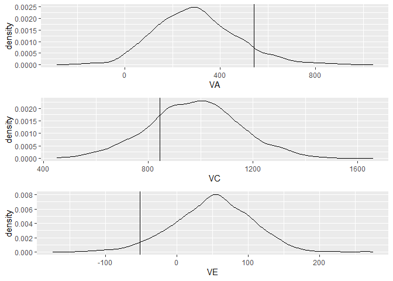

Portfolio 8
================
Xuanyu
4/19/2022

### This document is Xuanyu’s 8th portfolio for Mason’s R course. This portfolio demontrates a simulation using the ideal a,c,e components in the population to draw the distributions of a,c,e with a specific relativeness setting (rather than MZ vs. DZ). The purpose of the simulation is to demonstrate where our real estimate falls on the distributions from a population. In the other word, we want to test if our estimate with small samples and non-classical ACE can be a reliable estimate by a non parametric approach. Also, we created some density plots to visualize the distributions.

``` r
setwd(dirname(rstudioapi::getActiveDocumentContext()$path))
## Functions for simulation
source("func_kinsim.R")

# basic settings
set.seed(1327)
l.sim.CFPS <- list()

# total variance
V = 1334.583

# number of simulated models
nmodel <- 1000

# create dataframes with exact N for each groups
for(i in 1: nmodel){
     l.sim.CFPS[[i]] <- diff_size(
          116,
          61,
          rel = c(.737, 0.5),
          ace = c(V*.22,
                  V*.74,
                  V*.04),
          mu = 134
     )
}


# put simulated data into the ACE model
l.output.CFPS <- list()

for(i in 1:nmodel){
     l_doubledata.CFPS <- sep_kin(l.sim.CFPS[[i]])
     l.output.CFPS[[i]] <- fit_siACE(l_doubledata.CFPS[[1]], l_doubledata.CFPS[[2]],.737 , elbound = FALSE )
}
```

    ## Loading required package: OpenMx

``` r
# Get the estimated variance components for each model
df_output.CFPS <- data.frame("Model"= 1:nmodel, 
                        "coeAM"= as.numeric(NA),
                        "V" = as.numeric(NA),
                        "VA" = as.numeric(NA),
                        "VC" = as.numeric(NA),
                        "VE" = as.numeric(NA))
for(i in 1:nmodel){
     df_output.CFPS[i,2] <- .738
     df_output.CFPS[i,3] <- l.output.CFPS[[i]]@algebras$V$result[1]
     df_output.CFPS[i,4:6] <- l.output.CFPS[[i]]@algebras$US$result[1:3]
}


library(ggplot2)
## density plot with actual estimates from free ACE model as vertical lines
p1 <- ggplot(data = df_output.CFPS, mapping = aes(x = VA))+
     geom_density()+ geom_vline(xintercept = 542.101)
p2 <-ggplot(data = df_output.CFPS, mapping = aes(x = VC))+
     geom_density()+ geom_vline(xintercept = 844.0925)
p3 <-ggplot(data = df_output.CFPS, mapping = aes(x = VE))+
     geom_density()+ geom_vline(xintercept = -51.61093)
multiplot(p1,p2,p3)
```

    ## Loading required package: grid

<!-- -->

``` r
# ## density plot with actual estimates from an ACE model limiting VE to be greater than 0 as vertical lines
# p4 <-ggplot(data = df_output.CFPS, mapping = aes(x = VA))+
#      geom_density()+ geom_vline(xintercept = 377.67)
# p5 <-ggplot(data = df_output.CFPS, mapping = aes(x = VC))+
#      geom_density()+ geom_vline(xintercept = 954.69)
# p6 <-ggplot(data = df_output.CFPS, mapping = aes(x = VE))+
#      geom_density()+ geom_vline(xintercept = .001)
# multiplot(p4,p5,p6)
```
