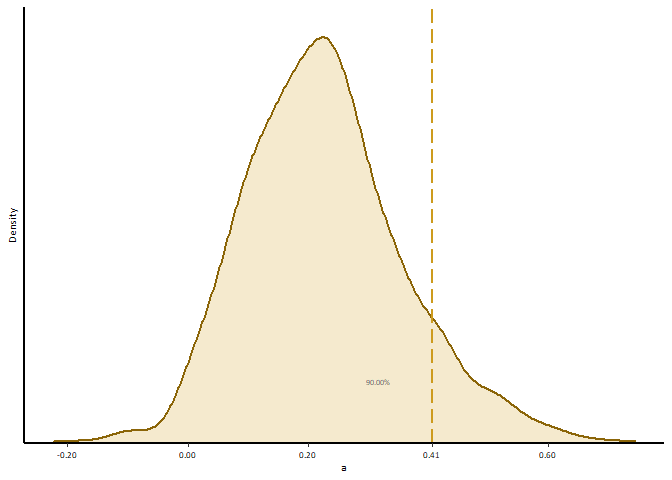
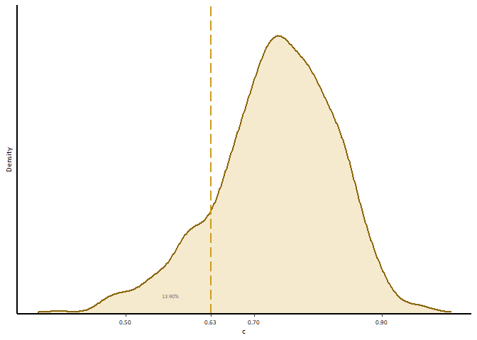
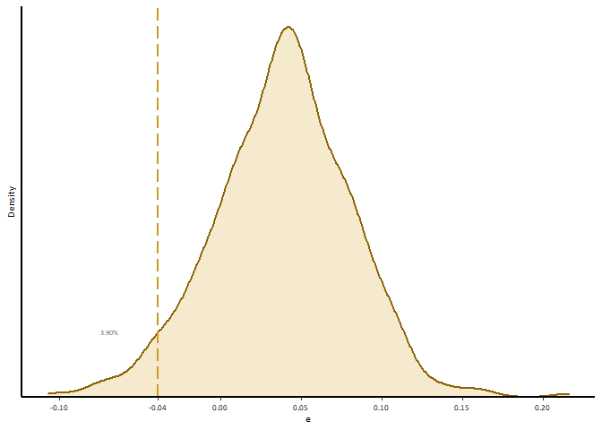
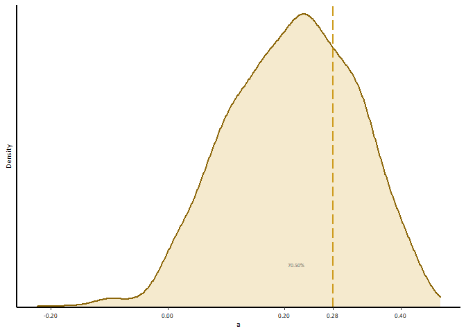
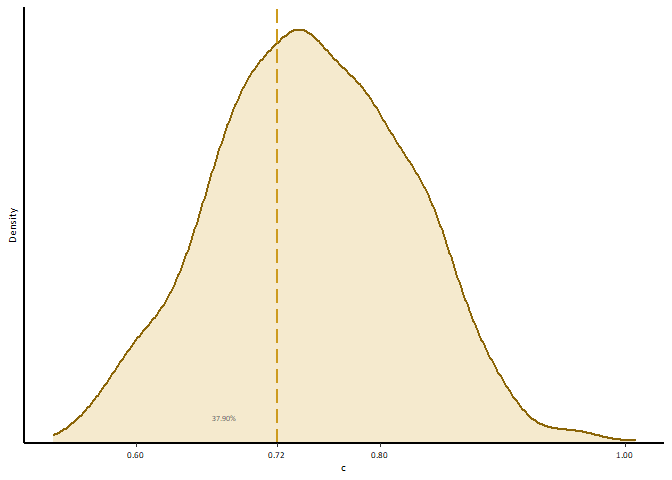
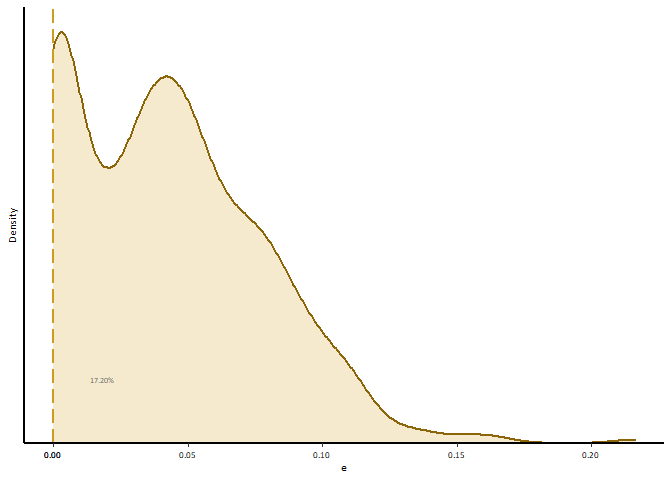

Portfolio 9
================
Xuanyu
4/25/2022

### This document is Xuanyu’s 9th portfolio for Mason’s R course. This portfolio demontrates the visualization of portfolio 8. In the visualization, I tried to create graphs with high quality and proper fonts and positions.

``` r
setwd(dirname(rstudioapi::getActiveDocumentContext()$path))
## Functions for simulation
source("func_kinsim.R")
library(scales)
library(ggplot2)
library(extrafont)
```

    ## Registering fonts with R

``` r
library(remotes)
# basic settings
set.seed(1327)
l.sim.CFPS <- list()

# total variance
V = 1334.583

# number of simulated models
nmodel <- 1000

# create dataframes with exact N for each groups
for(i in 1: nmodel){
     l.sim.CFPS[[i]] <- diff_size(
          116,
          61,
          rel = c(.737, 0.5),
          ace = c(V*.22,
                  V*.74,
                  V*.04),
          mu = 134
     )
}

###############no restriction model

# put simulated data into the ACE model
l.output.CFPS <- list()

for(i in 1:nmodel){
     l_doubledata.CFPS <- sep_kin(l.sim.CFPS[[i]])
     l.output.CFPS[[i]] <- fit_siACE(l_doubledata.CFPS[[1]], l_doubledata.CFPS[[2]],.737 , elbound = FALSE )
}
```

    ## Loading required package: OpenMx

``` r
# Get the estimated variance components for each model
df_output.CFPS <- data.frame("Model"= 1:nmodel, 
                        "coeAM"= as.numeric(NA),
                        "V" = as.numeric(NA),
                        "VA" = as.numeric(NA),
                        "VC" = as.numeric(NA),
                        "VE" = as.numeric(NA))
for(i in 1:nmodel){
     df_output.CFPS[i,2] <- .737
     df_output.CFPS[i,3] <- l.output.CFPS[[i]]@algebras$V$result[1]
     df_output.CFPS[i,4:6] <- l.output.CFPS[[i]]@algebras$US$result[1:3]
}

df_output.CFPS$a <- df_output.CFPS$VA / df_output.CFPS$V
df_output.CFPS$c <- df_output.CFPS$VC / df_output.CFPS$V
df_output.CFPS$e <- df_output.CFPS$VE / df_output.CFPS$V


ecdf(df_output.CFPS$a)(542.101/V)
```

    ## [1] 0.9

``` r
ecdf(df_output.CFPS$c)(844.0925/V)
```

    ## [1] 0.139

``` r
ecdf(df_output.CFPS$e)(-51.61093/V) 
```

    ## [1] 0.039

``` r
percent(ecdf(df_output.CFPS$a)(542.101/V), accuracy = .01)
```

    ## [1] "90.00%"

``` r
#remotes::install_version("Rttf2pt1", version = "1.3.8")
#extrafont::font_import()
#font_import()
loadfonts(device = "win")
```

    ## Agency FB already registered with windowsFonts().

    ## Algerian already registered with windowsFonts().

    ## Arial Black already registered with windowsFonts().

    ## Arial already registered with windowsFonts().

    ## Arial Narrow already registered with windowsFonts().

    ## Arial Rounded MT Bold already registered with windowsFonts().

    ## Bahnschrift already registered with windowsFonts().

    ## Baskerville Old Face already registered with windowsFonts().

    ## Bauhaus 93 already registered with windowsFonts().

    ## Bell MT already registered with windowsFonts().

    ## Berlin Sans FB already registered with windowsFonts().

    ## Berlin Sans FB Demi already registered with windowsFonts().

    ## Bernard MT Condensed already registered with windowsFonts().

    ## Blackadder ITC already registered with windowsFonts().

    ## Bodoni MT already registered with windowsFonts().

    ## Bodoni MT Black already registered with windowsFonts().

    ## Bodoni MT Condensed already registered with windowsFonts().

    ## Bodoni MT Poster Compressed already registered with windowsFonts().

    ## Book Antiqua already registered with windowsFonts().

    ## Bookman Old Style already registered with windowsFonts().

    ## Bookshelf Symbol 7 already registered with windowsFonts().

    ## Bradley Hand ITC already registered with windowsFonts().

    ## Britannic Bold already registered with windowsFonts().

    ## Broadway already registered with windowsFonts().

    ## Brush Script MT already registered with windowsFonts().

    ## Calibri already registered with windowsFonts().

    ## Calibri Light already registered with windowsFonts().

    ## Californian FB already registered with windowsFonts().

    ## Calisto MT already registered with windowsFonts().

    ## Cambria already registered with windowsFonts().

    ## Candara already registered with windowsFonts().

    ## Candara Light already registered with windowsFonts().

    ## Castellar already registered with windowsFonts().

    ## Centaur already registered with windowsFonts().

    ## Century already registered with windowsFonts().

    ## Century Gothic already registered with windowsFonts().

    ## Century Schoolbook already registered with windowsFonts().

    ## Chiller already registered with windowsFonts().

    ## Colonna MT already registered with windowsFonts().

    ## Comic Sans MS already registered with windowsFonts().

    ## Consolas already registered with windowsFonts().

    ## Constantia already registered with windowsFonts().

    ## Cooper Black already registered with windowsFonts().

    ## Copperplate Gothic Bold already registered with windowsFonts().

    ## Copperplate Gothic Light already registered with windowsFonts().

    ## Corbel already registered with windowsFonts().

    ## Corbel Light already registered with windowsFonts().

    ## Courier New already registered with windowsFonts().

    ## Curlz MT already registered with windowsFonts().

    ## Dubai already registered with windowsFonts().

    ## Dubai Light already registered with windowsFonts().

    ## Dubai Medium already registered with windowsFonts().

    ## Ebrima already registered with windowsFonts().

    ## Edwardian Script ITC already registered with windowsFonts().

    ## Elephant already registered with windowsFonts().

    ## Engravers MT already registered with windowsFonts().

    ## Eras Bold ITC already registered with windowsFonts().

    ## Eras Demi ITC already registered with windowsFonts().

    ## Eras Light ITC already registered with windowsFonts().

    ## Eras Medium ITC already registered with windowsFonts().

    ## Felix Titling already registered with windowsFonts().

    ## Footlight MT Light already registered with windowsFonts().

    ## Forte already registered with windowsFonts().

    ## Franklin Gothic Book already registered with windowsFonts().

    ## Franklin Gothic Demi already registered with windowsFonts().

    ## Franklin Gothic Demi Cond already registered with windowsFonts().

    ## Franklin Gothic Heavy already registered with windowsFonts().

    ## Franklin Gothic Medium already registered with windowsFonts().

    ## Franklin Gothic Medium Cond already registered with windowsFonts().

    ## Freestyle Script already registered with windowsFonts().

    ## French Script MT already registered with windowsFonts().

    ## Gabriola already registered with windowsFonts().

    ## Gadugi already registered with windowsFonts().

    ## Garamond already registered with windowsFonts().

    ## Georgia already registered with windowsFonts().

    ## Gigi already registered with windowsFonts().

    ## Gill Sans Ultra Bold already registered with windowsFonts().

    ## Gill Sans Ultra Bold Condensed already registered with windowsFonts().

    ## Gill Sans MT already registered with windowsFonts().

    ## Gill Sans MT Condensed already registered with windowsFonts().

    ## Gill Sans MT Ext Condensed Bold already registered with windowsFonts().

    ## Gloucester MT Extra Condensed already registered with windowsFonts().

    ## Goudy Old Style already registered with windowsFonts().

    ## Goudy Stout already registered with windowsFonts().

    ## Haettenschweiler already registered with windowsFonts().

    ## Harlow Solid Italic already registered with windowsFonts().

    ## Harrington already registered with windowsFonts().

    ## High Tower Text already registered with windowsFonts().

    ## HoloLens MDL2 Assets already registered with windowsFonts().

    ## Impact already registered with windowsFonts().

    ## Imprint MT Shadow already registered with windowsFonts().

    ## Informal Roman already registered with windowsFonts().

    ## Ink Free already registered with windowsFonts().

    ## Javanese Text already registered with windowsFonts().

    ## Jokerman already registered with windowsFonts().

    ## Juice ITC already registered with windowsFonts().

    ## Kristen ITC already registered with windowsFonts().

    ## Kunstler Script already registered with windowsFonts().

    ## Wide Latin already registered with windowsFonts().

    ## Leelawadee already registered with windowsFonts().

    ## Leelawadee UI already registered with windowsFonts().

    ## Leelawadee UI Semilight already registered with windowsFonts().

    ## Lucida Bright already registered with windowsFonts().

    ## Lucida Calligraphy already registered with windowsFonts().

    ## Lucida Console already registered with windowsFonts().

    ## Lucida Fax already registered with windowsFonts().

    ## Lucida Handwriting already registered with windowsFonts().

    ## Lucida Sans already registered with windowsFonts().

    ## Lucida Sans Typewriter already registered with windowsFonts().

    ## Lucida Sans Unicode already registered with windowsFonts().

    ## Magneto already registered with windowsFonts().

    ## Maiandra GD already registered with windowsFonts().

    ## Malgun Gothic already registered with windowsFonts().

    ## Malgun Gothic Semilight already registered with windowsFonts().

    ## Marlett already registered with windowsFonts().

    ## Matura MT Script Capitals already registered with windowsFonts().

    ## Microsoft Himalaya already registered with windowsFonts().

    ## Microsoft Yi Baiti already registered with windowsFonts().

    ## Microsoft New Tai Lue already registered with windowsFonts().

    ## Microsoft PhagsPa already registered with windowsFonts().

    ## Microsoft Sans Serif already registered with windowsFonts().

    ## Microsoft Tai Le already registered with windowsFonts().

    ## Microsoft Uighur already registered with windowsFonts().

    ## Mistral already registered with windowsFonts().

    ## Modern No. 20 already registered with windowsFonts().

    ## Mongolian Baiti already registered with windowsFonts().

    ## Monotype Corsiva already registered with windowsFonts().

    ## MS Outlook already registered with windowsFonts().

    ## MS Reference Sans Serif already registered with windowsFonts().

    ## MS Reference Specialty already registered with windowsFonts().

    ## MT Extra already registered with windowsFonts().

    ## MV Boli already registered with windowsFonts().

    ## Myanmar Text already registered with windowsFonts().

    ## Niagara Engraved already registered with windowsFonts().

    ## Niagara Solid already registered with windowsFonts().

    ## Nirmala UI already registered with windowsFonts().

    ## Nirmala UI Semilight already registered with windowsFonts().

    ## OCR A Extended already registered with windowsFonts().

    ## Old English Text MT already registered with windowsFonts().

    ## Onyx already registered with windowsFonts().

    ## Palace Script MT already registered with windowsFonts().

    ## Palatino Linotype already registered with windowsFonts().

    ## Papyrus already registered with windowsFonts().

    ## Parchment already registered with windowsFonts().

    ## Perpetua already registered with windowsFonts().

    ## Perpetua Titling MT already registered with windowsFonts().

    ## Playbill already registered with windowsFonts().

    ## Poor Richard already registered with windowsFonts().

    ## Pristina already registered with windowsFonts().

    ## Rage Italic already registered with windowsFonts().

    ## Ravie already registered with windowsFonts().

    ## Rockwell already registered with windowsFonts().

    ## Rockwell Condensed already registered with windowsFonts().

    ## Rockwell Extra Bold already registered with windowsFonts().

    ## Script MT Bold already registered with windowsFonts().

    ## Segoe MDL2 Assets already registered with windowsFonts().

    ## Segoe Print already registered with windowsFonts().

    ## Segoe Script already registered with windowsFonts().

    ## Segoe UI already registered with windowsFonts().

    ## Segoe UI Light already registered with windowsFonts().

    ## Segoe UI Semibold already registered with windowsFonts().

    ## Segoe UI Semilight already registered with windowsFonts().

    ## Segoe UI Black already registered with windowsFonts().

    ## Segoe UI Emoji already registered with windowsFonts().

    ## Segoe UI Historic already registered with windowsFonts().

    ## Segoe UI Symbol already registered with windowsFonts().

    ## Showcard Gothic already registered with windowsFonts().

    ## SimSun-ExtB already registered with windowsFonts().

    ## Snap ITC already registered with windowsFonts().

    ## Stencil already registered with windowsFonts().

    ## Sylfaen already registered with windowsFonts().

    ## Symbol already registered with windowsFonts().

    ## Tahoma already registered with windowsFonts().

    ## Tempus Sans ITC already registered with windowsFonts().

    ## Times New Roman already registered with windowsFonts().

    ## Trebuchet MS already registered with windowsFonts().

    ## Tw Cen MT already registered with windowsFonts().

    ## Tw Cen MT Condensed already registered with windowsFonts().

    ## Tw Cen MT Condensed Extra Bold already registered with windowsFonts().

    ## Verdana already registered with windowsFonts().

    ## Viner Hand ITC already registered with windowsFonts().

    ## Vivaldi already registered with windowsFonts().

    ## Vladimir Script already registered with windowsFonts().

    ## Webdings already registered with windowsFonts().

    ## Wingdings already registered with windowsFonts().

    ## Wingdings 2 already registered with windowsFonts().

    ## Wingdings 3 already registered with windowsFonts().

``` r
## density plot with actual estimates from free ACE model as vertical lines
p1 <- ggplot(data = df_output.CFPS, mapping = aes(x = a))+
     geom_density(color = "darkgoldenrod4", size = 1, fill = "darkgoldenrod3", alpha = .2)+ 
        geom_vline(xintercept = 542.101/V, linetype=5, size =1, color = "goldenrod3")+
        labs(x = "a", y = "Density",face = "bold")+
        scale_y_continuous(expand = c(0,0), limits = c(0,3.5))+
        scale_x_continuous(breaks = c(pretty(df_output.CFPS$a)[c(1:4,6)],542.101/V), labels = label_number(accuracy = 0.01))+
        annotate(geom = "text",x = 542.101*.78/V, y =.5, label = percent(ecdf(df_output.CFPS$a)(542.101/V), accuracy = .01), family="Calibri", color = "gray40",size = 2)+
        theme(panel.background = element_rect(fill = "transparent"),
           panel.grid = element_line(color = "transparent"),
           axis.line = element_line(size = 1, colour = "black"),
           #axis.line.y = element_blank(),
           axis.text = element_text( color = "black"),
           axis.text.y = element_blank(),
           axis.ticks.y = element_blank(),
           text=element_text( family="Calibri",  size = 8))
p1
```

<!-- -->

``` r
p2 <-ggplot(data = df_output.CFPS, mapping = aes(x = c))+
        geom_density(color = "darkgoldenrod4", size = 1, fill = "darkgoldenrod3", alpha = .2)+ 
        geom_vline(xintercept = 844.0925/V, linetype=5, size =1, color = "goldenrod3")+
        labs( y = "Density",face = "bold",)+
        scale_y_continuous(expand = c(0,0), limits = c(0,5))+
        scale_x_continuous(breaks = c(pretty(df_output.CFPS$c)[c(1,3,5,7,9)],844.0925/V), labels = label_number(accuracy = 0.01))+
        annotate(geom = "text",x = 844.0925*.9/V, y =.3, label = percent(ecdf(df_output.CFPS$c)(844.0925/V), accuracy = .01), family="Calibri", color = "gray40",size = 2)+
        theme(panel.background = element_rect(fill = "transparent"),
              panel.grid = element_line(color = "transparent"),
              axis.line = element_line(size = 1, colour = "black"),
              #axis.line.y = element_blank(),
              axis.text = element_text( color = "black"),
              axis.text.y = element_blank(),
              axis.ticks.y = element_blank(),
              text=element_text( family="Calibri",  size = 8))
p2
```

<!-- -->

``` r
p3 <-ggplot(data = df_output.CFPS, mapping = aes(x = e))+
        geom_density(color = "darkgoldenrod4", size = 1, fill = "darkgoldenrod3", alpha = .2)+ 
        geom_vline(xintercept = -51.61093/V, linetype=5, size =1, color = "goldenrod3")+
        labs( y = "Density",face = "bold",)+
        scale_y_continuous(expand = c(0,0), limits = c(0,11.3))+
        scale_x_continuous(breaks = c(pretty(df_output.CFPS$e)[c(1:2,4:9)],-51.61093/V), labels = label_number(accuracy = 0.01))+
        annotate(geom = "text",x = (-51.61093-40)/V, y =1.9, label = percent(ecdf(df_output.CFPS$e)(-51.61093/V), accuracy = .01), family="Calibri", color = "gray40",size = 2)+
        theme(panel.background = element_rect(fill = "transparent"),
              panel.grid = element_line(color = "transparent"),
              axis.line = element_line(size = 1, colour = "black"),
              #axis.line.y = element_blank(),
              axis.text = element_text( color = "black"),
              axis.text.y = element_blank(),
              axis.ticks.y = element_blank(),
              text=element_text( family="Calibri",  size = 8))
p3
```

<!-- -->

``` r
#mp1 <- multiplot(p1,p2,p3,cols = 3)

#library(Cairo)
#ggsave( "p1.png",p1,width = 2, height = 1.5,  type = "cairo-png", dpi = 900)
#ggsave( "p2.png",p2,width = 2, height = 1.5,  type = "cairo-png", dpi = 900)
#ggsave( "p3.png",p3,width = 2, height = 1.5,  type = "cairo-png", dpi = 900)


###############restricted model

# put simulated data into the ACE model
l.output.CFPS <- list()

for(i in 1:nmodel){
        l_doubledata.CFPS <- sep_kin(l.sim.CFPS[[i]])
        l.output.CFPS[[i]] <- fit_siACE(l_doubledata.CFPS[[1]], l_doubledata.CFPS[[2]],.737 , elbound = TRUE )
}

# Get the estimated variance components for each model
df_output.CFPS2 <- data.frame("Model"= 1:nmodel, 
                             "coeAM"= as.numeric(NA),
                             "V" = as.numeric(NA),
                             "VA" = as.numeric(NA),
                             "VC" = as.numeric(NA),
                             "VE" = as.numeric(NA))
for(i in 1:nmodel){
        df_output.CFPS2[i,2] <- .737
        df_output.CFPS2[i,3] <- l.output.CFPS[[i]]@algebras$V$result[1]
        df_output.CFPS2[i,4:6] <- l.output.CFPS[[i]]@algebras$US$result[1:3]
}

df_output.CFPS2$a <- df_output.CFPS2$VA / df_output.CFPS2$V
df_output.CFPS2$c <- df_output.CFPS2$VC / df_output.CFPS2$V
df_output.CFPS2$e <- df_output.CFPS2$VE / df_output.CFPS2$V


ecdf(df_output.CFPS2$a)(377.67/V)
```

    ## [1] 0.718

``` r
ecdf(df_output.CFPS2$c)(954.69/V)
```

    ## [1] 0.369

``` r
ecdf(df_output.CFPS2$e)(.001/V) 
```

    ## [1] 0.077

``` r
## density plot with actual estimates from free ACE model as vertical lines
p4 <- ggplot(data = df_output.CFPS2, mapping = aes(x = a))+
        geom_density(color = "darkgoldenrod4", size = 1, fill = "darkgoldenrod3", alpha = .2)+ 
        geom_vline(xintercept = 377.67/V, linetype=5, size =1, color = "goldenrod3")+
        labs(x = "a", y = "Density",face = "bold")+
        scale_y_continuous(expand = c(0,0), limits = c(0,3.5))+
        scale_x_continuous(breaks = c(pretty(df_output.CFPS$a),377.67/V), labels = label_number(accuracy = 0.01))+
        annotate(geom = "text",x = 377.67*.78/V, y =.5, label = percent(ecdf(df_output.CFPS$a)(377.67/V), accuracy = .01), family="Calibri", color = "gray40",size = 2)+
        theme(panel.background = element_rect(fill = "transparent"),
              panel.grid = element_line(color = "transparent"),
              axis.line = element_line(size = 1, colour = "black"),
              #axis.line.y = element_blank(),
              axis.text = element_text( color = "black"),
              axis.text.y = element_blank(),
              axis.ticks.y = element_blank(),
              text=element_text( family="Calibri",  size = 8))
p4
```

<!-- -->

``` r
p5 <-ggplot(data = df_output.CFPS2, mapping = aes(x = c))+
        geom_density(color = "darkgoldenrod4", size = 1, fill = "darkgoldenrod3", alpha = .2)+ 
        geom_vline(xintercept = 954.69/V, linetype=5, size =1, color = "goldenrod3")+
        labs( y = "Density",face = "bold",)+
        scale_y_continuous(expand = c(0,0), limits = c(0,5))+
        scale_x_continuous(breaks = c(pretty(df_output.CFPS$c)[c(2,4,6,8)],954.69/V), labels = label_number(accuracy = 0.01))+
        annotate(geom = "text",x = 954.69*.94/V, y =.3, label = percent(ecdf(df_output.CFPS$c)(954.69/V), accuracy = .01), family="Calibri", color = "gray40",size = 2)+
        theme(panel.background = element_rect(fill = "transparent"),
              panel.grid = element_line(color = "transparent"),
              axis.line = element_line(size = 1, colour = "black"),
              #axis.line.y = element_blank(),
              axis.text = element_text( color = "black"),
              axis.text.y = element_blank(),
              axis.ticks.y = element_blank(),
              text=element_text( family="Calibri",  size = 8))
p5
```

<!-- -->

``` r
p6 <-ggplot(data = df_output.CFPS2, mapping = aes(x = e))+
        geom_density(color = "darkgoldenrod4", size = 1, fill = "darkgoldenrod3", alpha = .2)+ 
        geom_vline(xintercept = .001/V, linetype=5, size =1, color = "goldenrod3")+
        labs( y = "Density",face = "bold",)+
        scale_y_continuous(expand = c(0,0), limits = c(0,13))+
        scale_x_continuous(breaks = c(pretty(df_output.CFPS$e)[c(4:9)],0), labels = label_number(accuracy = 0.01))+
        annotate(geom = "text",x = 0.001+0.017, y =1.9, label = percent(ecdf(df_output.CFPS$e)(.001/V), accuracy = .01), family="Calibri", color = "gray40",size = 2)+
        theme(panel.background = element_rect(fill = "transparent"),
              panel.grid = element_line(color = "transparent"),
              axis.line = element_line(size = 1, colour = "black"),
              #axis.line.y = element_blank(),
              axis.text = element_text( color = "black"),
              axis.text.y = element_blank(),
              axis.ticks.y = element_blank(),
              text=element_text( family="Calibri",  size = 8))
p6
```

<!-- -->

``` r
#mp2 <- multiplot(p4,p5,p6,cols = 3)

#library(Cairo)
#ggsave( "p4.png",p4,width = 2, height = 1.5,  type = "cairo-png", dpi = 900)
#ggsave( "p5.png",p5,width = 2, height = 1.5,  type = "cairo-png", dpi = 900)
#ggsave( "p6.png",p6,width = 2, height = 1.5,  type = "cairo-png", dpi = 900)
```
